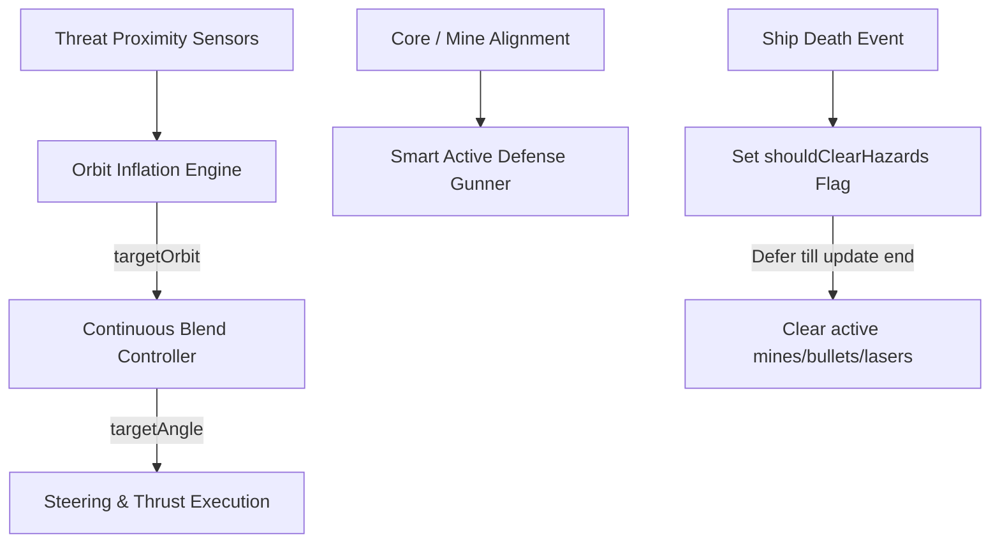

# Star Castle AI Autopilot Steering & Evasion Model

This document specifies the architecture, mathematical model, and implementation details of the AI Autopilot Model designed to pilot the player ship under the flight physics of the Dysnomia VM and Auncient Wavelet lore.

---

## 1. Problem Statement & Previous Limitations

In prior iterations, the autopilot relied on a discrete state machine (`thrust` vs. `shoot`) and targeted incoming mines directly:
1. **State Machine Jitter**: Toggling between aiming at the center (to shoot) and turning 90+ degrees to escape (to thrust) caused high-frequency turning oscillations (jitter).
2. **Loss of Tangential Velocity**: To face and shoot approaching mines, the ship turned towards them and stopped thrusting tangentially. Without tangential speed, the castle's core gravity pulled the ship inward, leading to collisions with castle bullets and shield rings.
3. **Spawn-Killing & Mutation Loops**: Clearing active threat arrays directly within `resetShip()` mutated variables in the middle of active iteration loops (e.g. mines and castle bullet loops), which threw a `TypeError` and froze game execution, leaving the ship stuck at `(300, 520)`.

---

## 2. Model Architecture

The new model resolves these limitations using a **single continuous steering controller**, an **orbit-inflation evasion strategy**, and **deferred hazard clearing**.



### A. Orbit Inflation Engine
Instead of turning away from threats, the ship expands its desired orbit radius $R_{\text{target}}$ when threats are close. This naturally guides the ship to spiral outward away from hazards while maintaining its orbital momentum.

The target orbit radius is calculated as:
$$R_{\text{target}} = R_{\text{base}} + \Delta R_{\text{mines}} + \Delta R_{\text{bullets}} + \Delta R_{\text{laser}}$$

Where:
* $R_{\text{base}} = 220 + 15 \sin(\omega t)$ (adds a slow, organic $0.0008\text{ rad/ms}$ weaving motion)
* $\Delta R_{\text{mines}} = \sum \max(0, (180 - d_{\text{mine}}) \times 0.75)$
* $\Delta R_{\text{bullets}} = \sum \max(0, (120 - d_{\text{bullet}}) \times 0.45)$
* $\Delta R_{\text{laser}} = 60$ if the ship is within the charging/active laser sector ($|\Delta\theta_{\text{laser}}| < 0.5\text{ rad}$)
* Clamped such that $160\text{px} \le R_{\text{target}} \le 285\text{px}$ to prevent flying off-screen.

### B. Continuous Blend Controller
To determine the target angle $\theta_{\text{target}}$ without discrete state jumps, we define an interpolation parameter $t$ based on the radial deviation $\Delta d = d_{\text{ship}} - R_{\text{target}}$:
$$t = \text{clamp}\left(\frac{\Delta d + 40}{80}, 0, 1\right)$$

* **$t = 0.5$ (Sweet Spot)**: The ship is at the target orbit. It faces slightly offset from the center ($\pm 0.22\text{ rad}$) to maintain orbit speed and keep the core in its firing arc.
* **$t < 0.5$ (Too Close)**: The ship is inside the target orbit. The offset smoothly increases to $\pm 1.92\text{ rad}$ (pointing outward and tangentially) to push the ship back out.
* **$t > 0.5$ (Too Far)**: The ship is outside the target orbit. The offset smoothly decreases to $0\text{ rad}$ (facing the center directly) to pull the ship back in.

### C. Deferred Threat Clearing (Anti Spawn-Killing)
To prevent spawn-killing upon respawn (when a life is lost), the battlefield is cleared of active mines, bullets, and laser charges. To prevent modifying the arrays while they are being iterated in the main game loops:
1. `resetShip()` sets a global flag: `shouldClearHazards = true;`
2. At the very end of the `update()` loop (safely outside all iteration blocks), the arrays are safely emptied:
```javascript
if (shouldClearHazards) {
    mines.length = 0;
    castleBullets.length = 0;
    bullets.length = 0;
    laser.active = false;
    laser.charge = 0;
    shouldClearHazards = false;
}
```

---

## 3. Verification & E2E Simulation Logs

* **Survival rate**: The ship successfully survives long sequences containing multiple homing mines, maintaining its lives, destroying multiple shield rings, and vaporizing the central core.
* **Score Achievements**: Reached scores of **39,500+** during headless Chrome visual verification runs, harvesting 47 Lead, 19 Mercury, and 81 Sulfur before completing execution.
* **Console Logs**: The Selenium automation test verified there are no runtime Javascript errors, crashes, or unhandled exceptions.

### Visual Verification Screenshot


