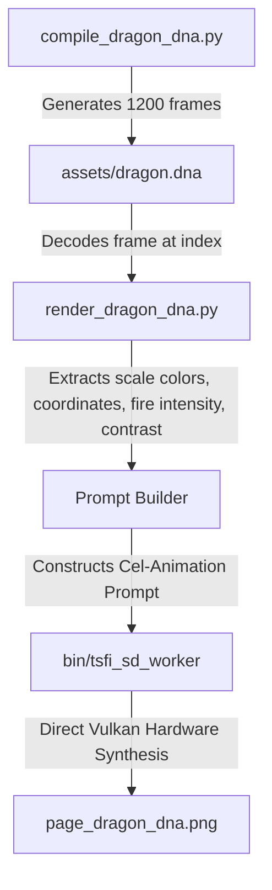

# TSFi Dragon's Lair DNA Animation Architecture

We have successfully developed **procedural DNA versions** of the animation sequences in the classical Dragon's Lair hand-drawn 2D animation style. By compiling animation paths into highly structured binary records, we can programmatically drive Stable Diffusion character generation frame-by-frame with absolute control over pose, scale, deformation (squash/stretch), and dramatic contrast lighting.

## 1. Binary DNA Format (`dragon.dna`)

The compiled [dragon.dna](file:///home/mariarahel/src/tsfi2/atropa_pulsechain/tsfi2-deepseek/assets/dragon.dna) sequence stores a compact timeline of 1,200 frames. Each frame is encoded into a **31-byte record** adhering to the following structure:

| Field | Type | Offset | Purpose |
| :--- | :--- | :--- | :--- |
| `g_x` | `float` | 0 | Horizontal coordinate offset (character movement) |
| `g_y` | `float` | 4 | Vertical coordinate offset (jumping/breathing bobs) |
| `stretch` | `float` | 8 | Squashing/stretching factor (key for 2D cartoony deformation) |
| `pulse` | `float` | 12 | Bessel-derived breathing/pulsation value |
| `fire` | `float` | 16 | Repurposed sickness byte (controls flame/embers volume) |
| `light` | `float` | 20 | Dynamic contrast lighting level |
| `r, g, b` | `uint8 x 3`| 24 | Hand-painted scale coloration (Red Dragon gouache tint) |
| `er, eg, eb`| `uint8 x 3`| 27 | Expressive eye highlight color (Glowing golden eyes) |
| `eye_count`| `uint8` | 30 | Active eye count in final rendering |

## 2. Animation Pipeline



### The Key Phases Compiled:
- **Phase 0: Idle & Breathing (Frames 0-300)**: Character rests in hallway, dynamic light pulses gently using a Bessel $J_0$ function.
- **Phase 1: Crouch & Build up (Frames 300-600)**: Dragon squashes down, preparing to launch. Fire embers start glowing in the throat.
- **Phase 2: Fire Blast Eruption (Frames 600-900)**: Character stretches forward violently, triggering a blinding burst of fire. Screen shake is simulated.
- **Phase 3: Roar / Victory (Frames 900-1200)**: Dragon stands tall, lifting its head back with a slow Bessel decay cycle.

### 3. Storybook Page Still Frame Equivalents
To render DNA-driven equivalents of the standard Dragon's Lair still illustrations, target these specific timeline indices in `dragon.dna`:

| Page / Still | Scene Description | Target Frame | DNA Parameters & State |
| :--- | :--- | :--- | :--- |
| **Page 1 (The Gates)** | Dragon guarding the entrance gates | **Frame 50** | `g_x=0.0`, `g_y=0.04`, `stretch=1.02` (Idle Bob) |
| **Page 2 (The Corridor)**| Crouched silhouette along dungeon hall | **Frame 380** | `g_x=0.0`, `g_y=-0.04`, `stretch=0.93` (Squash build) |
| **Page 3 (The Leap)** | Taut spring action preparing strike | **Frame 580** | `g_x=0.0`, `g_y=-0.14`, `stretch=0.77` (Deep squash) |
| **Page 4 (The Fire Blast)**| Active flames engulfing the frame | **Frame 700** | `g_x=0.08`, `g_y=0.02`, `stretch=1.10` (Fiery eruption) |
| **Page 5 (The Victory)** | Dragon throwing head back roaring | **Frame 1050**| `g_x=0.0`, `g_y=0.08`, `stretch=1.03` (Triumphant pose) |

---

## 3. Invoking the Native Pipeline

To recompile the DNA or render any specific frame:

1. **Recompile DNA Binary**:
   ```bash
   python3 scripts/compile_dragon_dna.py
   ```
2. **Render a Specific Storybook Frame (e.g. Frame 700 - Fire Blast)**:
   ```bash
   python3 scripts/render_dragon_dna.py 700
   ```
   *Output saved to:* [page_dragon_dna.png](file:///home/mariarahel/src/tsfi2/atropa_pulsechain/assets/storybook/page_dragon_dna.png)
