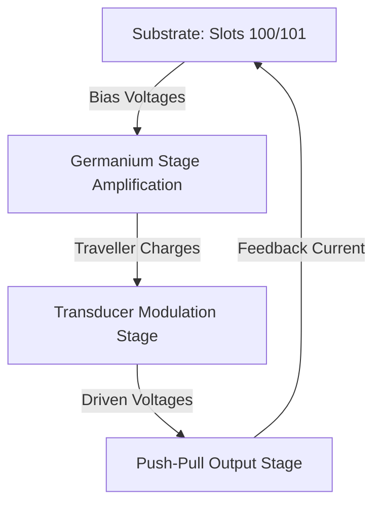

# TSFi2 Synthesis & Telemetry Studio: Architecture & Module Guide

This document defines all the components comprising the **TSFi2 Synthesis & Telemetry Studio**. The studio combines physical analog circuit modeling in Yul bytecode (executed on the ZMM VM) with real-time visual telemetry and interactive controls in the web interface.

---

## 1. Physical Synthesis Modules (The Core Sound Engines)

These modules run statefully on the ZMM VM to generate raw audio signals:

### A. 🎹 Philicorda Neon Generator
*   **Source File**: [`philicordaGenerator.yul`](file:///home/mariarahel/src/tsfi2/atropa_pulsechain/solidity/bin/philicordaGenerator.yul)
*   **Description**: Models the Philips Philicorda electronic organ. It simulates neon gas-discharge relaxation oscillation (producing a raw sawtooth wave) coupled with a bistable frequency divider (generating a sub-octave square wave).

### B. 🌀 Tunnel Diode VCO
*   **Source File**: [`tunnelDiodeOscillator.yul`](file:///home/mariarahel/src/tsfi2/atropa_pulsechain/solidity/bin/tunnelDiodeOscillator.yul)
*   **Description**: Models a high-frequency oscillator using the Negative Differential Resistance (NDR) region of a Germanium tunnel diode coupled to a parallel LC resonant tank, producing warm, harmonically rich waveforms.

### C. 🧪 Germanium Common-Emitter Stage (Issue 1)
*   **Source File**: [`germaniumStage.yul`](file:///home/mariarahel/src/tsfi2/atropa_pulsechain/solidity/bin/germaniumStage.yul)
*   **Description**: Models an OC71 Germanium transistor gain stage. Solves base-emitter junction current non-linearity ($V_{be}$-$I_b$) using a signed Newton-Raphson solver. Features dynamic capacitor discharge paths to simulate bias sag and recovery under heavy signal drive.

### D. 💨 Steam Whistle & Flickering Flame (Issue 1)
*   **Source File**: [`steamWhistle.yul`](file:///home/mariarahel/src/tsfi2/atropa_pulsechain/solidity/bin/steamWhistle.yul)
*   **Description**: A dual-mode sound generator.
    *   **Whistle Mode**: TUP-TUN relaxation oscillator producing a whistling tone mixed with filtered avalanche breakdown noise.
    *   **Flame Mode**: Slows the oscillator to low frequencies ($2\text{Hz} - 15\text{Hz}$) modulated by noise to generate roaring, crackling fire crackles.

### E. 🥁 Membrane Drum Synthesizer (Issue 2)
*   **Source File**: [`drumSynthesizer.yul`](file:///home/mariarahel/src/tsfi2/atropa_pulsechain/solidity/bin/drumSynthesizer.yul)
*   **Description**: A state-variable tonal drum generator that models a spring-mass-damper membrane kicked by trigger velocity impulses to create damped tom-tom/kick hits.

### F. 🥁 Snare & Metal Drum Synthesizer (Issue 2)
*   **Source File**: [`snareSynthesizer.yul`](file:///home/mariarahel/src/tsfi2/atropa_pulsechain/solidity/bin/snareSynthesizer.yul)
*   **Description**: Mixes a tonal membrane resonator with an internal pseudo-random noise generator shaped by a fast-decaying envelope to synthesize snare drums, hi-hats, and metallic hits.

---

## 2. Processing & Filtering Modules (The Shapers)

These modules shape, filter, or limit the generated synthesis signals:

### A. 🌀 Gyrator Active Filter (Issue 2)
*   **Source File**: [`gyratorFilter.yul`](file:///home/mariarahel/src/tsfi2/atropa_pulsechain/solidity/bin/gyratorFilter.yul)
*   **Description**: Simulates active inductor-capacitor (LC) bandpass filters using active simulated gyrators ($L_{eq} = R_1 R_2 C$) in a Chamberlin State-Variable Filter (SVF) configuration.

### B. 🎚️ Equa-Amplifier Master AGC Limiter (Issue 1)
*   **Source File**: [`equaAmplifier.yul`](file:///home/mariarahel/src/tsfi2/atropa_pulsechain/solidity/bin/equaAmplifier.yul)
*   **Description**: Master leveler enforcing dynamic Safe Operating Area (SOAR) current limits ($I_{limit} = 1.97\,\text{A}$). Adjusts the output voltage window based on load impedance ($1.0\text{V}$ for $0.51\,\Omega$; $1.5\text{V}$ for $0.76\,\Omega$) to prevent digital clipping.

---

## 3. Control & Telemetry Interfaces (The Dashboard)

The visual and interactive layers connecting the user to the ZMM VM environment:

### A. 📺 Live Oscilloscope Canvas
*   **Description**: Renders real-time output signal voltages dynamically on a canvas plot. Custom trace colors distinguish active modules (e.g., green for Drum, purple for Gyrator, blue for Whistle).

### B. ⚡ Nixie Telemetry Indicator (Issue 4)
*   **Source File**: [`z550mIndicator.yul`](file:///home/mariarahel/src/tsfi2/atropa_pulsechain/solidity/bin/z550mIndicator.yul)
*   **Description**: Displays program counters or active signal amplitudes on a virtual decade grid, emulating the Philips Z550M neon decade counting tube.

### C. 🧪 Debugger Link (Ubiquitous AI Debugging)
*   **Source File**: [`debugger.yul`](file:///home/mariarahel/src/tsfi2/atropa_pulsechain/solidity/bin/debugger.yul)
*   **Description**: Exposes register-level execution tracing and step-by-step assembly diagnostics of active VM state variables.

### D. 🎹 Interactive Controller Keyboard
*   **Description**: 13-note musical keyboard allowing users to play notes and dynamically set oscillator pitch coefficients in real-time.

---

## 4. Substrate-Coupled Op-Amp Technology (The Physical Interface)

This section defines the physical hardware coupling model where synthesizer-produced signals interact with the Auncient VM storage substrate:

### A. Substrate-Charge Coupling
Instead of utilizing standard high-level software signal routes, signal propagation is modeled as physical charge injection directly into the substrate memory layer. The synthesis output values dynamically charge or discharge target EVM storage slot variables:
*   **`V_c_in` (Slot `100`)**: Input coupling capacitor charge state.
*   **`V_c_e` (Slot `101`)**: Emitter bypass capacitor charge state.

### B. Germanium Emulation Substrate Alignment
The remaining material properties of the physical substrate are defined within the common-emitter equations of `germaniumStage.yul`. The injected synthesis charges modulate the conduction offsets of the simulated silicon/germanium junctions, linking active voice generation to the physical semiconductor model.

### C. Filter & Amplifier Integration in the 3 Analog Stages
*   **GermaniumStage (Pre-Amplifier)**:
    *   **Filter (`GyratorFilter`)**: Sub-bass rumble attenuation prior to base charge injection to prevent bias sag instability.
    *   **Amplifier (`EquaAmplifier`)**: Acts as a dynamic leveler post-saturation, aligning the pre-amplified output voltage with input bounds of downstream components.
*   **TransducerStage (Acoustic Modulation)**:
    *   **Filter (`GyratorFilter`)**: Bandpass filters the dynamic sound pressure input before offset modulation.
    *   **Amplifier (`EquaAmplifier`)**: Enforces output voltage envelopes when pressure transient spikes trigger SOAR protection thresholds.
*   **PushPullStage (Power Driver Output)**:
    *   **Filter (`GyratorFilter`)**: Low-pass filters the high-order crossover harmonics to smooth the output signal.
    *   **Amplifier (`EquaAmplifier`)**: Direct current-limiting safety buffer ($1.97\,\text{A}$) protecting the NPN/PNP output transistors from low load-impedance thermal runaway.

### D. Bi-directional Impedance Coupling & Pre-Composition
In physical analog circuits, stages do not operate as isolated, unidirectional software blocks. The components are coupled bi-directionally through loading effects:
*   **Dynamic Loading**: The input impedance of the `GermaniumStage` drops drastically when the base-emitter junction conducts heavily (saturating under high input signal amplitude).
*   **Pre-Composition Shifting**: This impedance drop dampens the active simulated inductance ($L_{eq}$) of the preceding `GyratorFilter`. By reading the substrate charge states (`V_c_in` / Slot `100`), the `GyratorFilter` dynamically decreases its Q-factor (damping resonance) and shifts its cutoff frequency. This alters the spectral pre-composition of the signal prior to base injection, preventing harsh digital clipping and emulating true analog feedback.

### E. The "Traveller Charge" Closed-Loop Feedback Cycle
The flow of charge is modeled as a closed thermodynamic loop where energy departs from, travels through, and returns to modify the physical substrate:

1. **Substrate Departure**: 
   The initial potential resides in base coupling capacitor `V_c_in` (Slot `100`) and emitter bypass capacitor `V_c_e` (Slot `101`). These values establish the transistor's baseline operating bias.
2. **Amplified Travel (The Outward Path)**: 
   As input signals pass through the common-emitter junction, the transistor amplifies these baseline potentials. The resulting energy acts as a dynamic "traveller charge" that propagates downstream:
   * It provides electrical bias inputs to the **TransducerStage**.
   * It drives the NPN/PNP gates of the **PushPullStage**.
3. **The Substrate Return (The Feedback Path)**: 
   The output signal is routed back to the input base-emitter junction through a feedback network. This returning feedback current ($I_{\text{feedback}}$) directly re-charges and modifies the substrate variables:
   $$\text{Slot } 100 \ (\text{V\_c\_in}) \leftarrow \text{V\_c\_in} + \frac{I_b \cdot dt}{C} - \text{Leakage}$$
   $$\text{Slot } 101 \ (\text{V\_c\_e}) \leftarrow \text{V\_c\_e} + \frac{I_e \cdot dt}{C} - \text{Discharge}$$

This completes the cycle: traveller charges leave the substrate to drive downstream stages, only to return as modified state variables, continuously shaping the operating bias of subsequent cycles.

---

## 5. YI/LAU Calibrated Lissajous Projection & Vocabulary Discovery

This section defines the alignment and discovery loop using user-specific identity parameters to calibrate and verify synthesis accuracy:

### A. YI & LAU Parameter Extraction
The user's registered `YI` registry and `LAU` token contract structures define the fundamental coordinate transforms of the Lissajous projection engine. Dynamic keys are extracted to calibrate:
* **Frequencies**: Tonewheel reference speeds and step size limits derived from user-specific hash roots.
* **Geometric Modifiers**: Asymmetry limits ($R_{hyp}, r_{hyp}$) mapped directly from the user's `LAU` identity.

### B. Dynamic Vocabulary Calibration Loop
To align the speech synthesizer with natural human voice characteristics, the system executes an automated discovery loop:
1. **Calibrated Capture**: Real-world voice samples of target vocabulary are fed through the capsule microphone, filtered, and projected as 3D Lissajous signatures using the `YI` & `LAU` calibrated tonewheel frequencies.
2. **Synthesizer Generation**: The speech synthesizer generates test audio using the exact same `YI` & `LAU` settings, executing the same Lissajous projection process.
3. **Proof-of-Practice Proofs**: The automation routine compares the synthesized projections against the target voice captures. It runs an optimization solver to align the synthesizer's registers until the geometric path projections match, providing cryptographic and geometric proof of synthesis accuracy.
