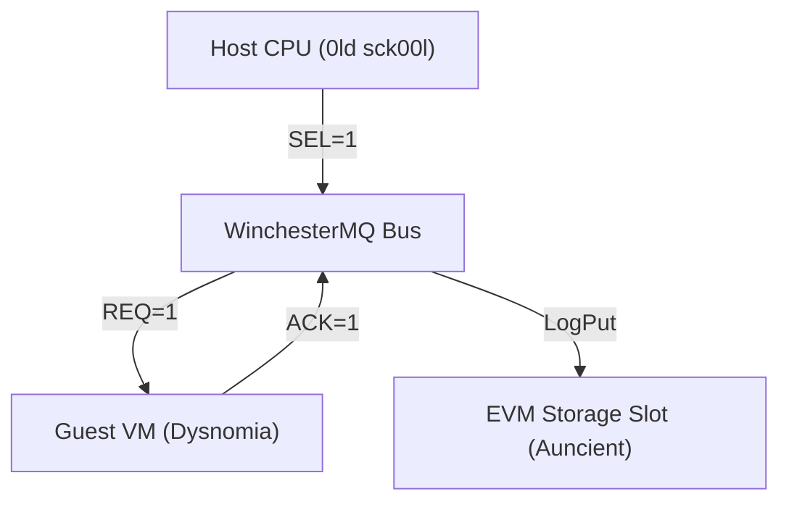

# The System0 Sabbatical: A Chronicle of teh 0ld sck00l

## Introduction
The **System0 Sabbatical** marks a legendary period of reflection and regression in the history of the Dysnomia VM. Weary of modern hyper-optimizations and the bloat of contemporary EVM gas models, the core engineers initiated a structural retreat to **teh 0ld sck00l** hardware principles. This archive preserves the legacy of that historical turning point.

## Core Tenets of teh 0ld sck00l
Teh 0ld sck00l philosophy rejects abstraction in favor of raw silicon interfaces. During the sabbatical, three core paradigms were established:

1. **Hardware-Locked Handshakes**
   Rather than relying on high-level transaction routing, all telemetry flows directly over simulated SASI/SCSI register interfaces. Command Descriptor Blocks (CDBs) are strictly 6 bytes, and data transfers are restricted to 256-byte sectors.
   
2. **Auncient Storage Manifolds**
   The storage layer discards complex dynamic arrays. Instead, it utilizes static storage slots representing raw disk cylinders and LUN paths, re-invoking the **Auncient** Wavelet storage blueprints.
   
3. **Discrete Interrupt Vectors**
   Telemetry is not event-driven in the modern reactive sense. It relies on the polling of hardware status pins ($DF01/$DF02) and direct bus ownership loops.

## Legacy of the Sabbatical
By enforcing a strict separation between modern execution networks and hardware emulation, the System0 Sabbatical successfully proved that zero-overhead compute is achievable only when we return to the metal. The WinchesterMQ interface remains the primary monument to this philosophy, preserving the Auncient traditions of direct memory access and registers mapping.
