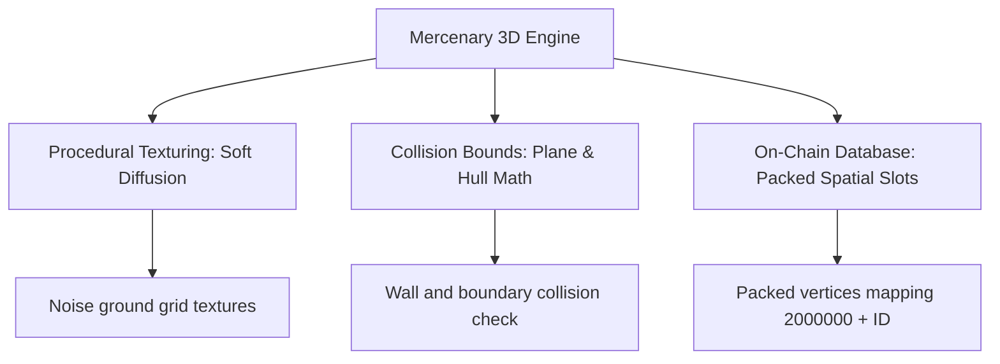

# Upgrading the Targ Mercenary 3D Map: Architectural Roadmap

This document outlines concrete improvements for the **Targ Mercenary 3D Map Demo** by applying the **7-Phase Tri-Model Ahead-Of-Time (AOT) Pipeline**. It details how to implement procedural texturing, optimize collision hull detection, and scale on-chain databases.

---

## 1. Core Areas of Improvement



---

## 2. Procedural "Soft Diffusion" Ground Texturing

Instead of drawing plain solid lines or filling wireframes with flat colors, we can introduce historical **Soft Diffusion** textures. By using a pseudorandom noise generator inside the rasterization step, we add textured noise to the ground grid and hangar walls, simulating Targ's sandy/rocky surface:

$$\text{Noise}(x, y) = \text{frac}(\sin(x \cdot 12.9898 + y \cdot 78.233) \cdot 43758.5453)$$

### Yul Soft Diffusion Noise Function

```yul
// Procedural texturing generator in Yul
function softDiffusionNoise(x, y) -> noiseValue {
    // Implement fract(sin(dot(co, [12.9898, 78.233])) * 43758.5453)
    let dotProduct := add(mul(x, 129898), mul(y, 78233))
    
    // Simulating sin using a multi-step modulo approximation
    let sinApprox := mod(dotProduct, 3141592)
    
    // Scale and multiply by the large irrational constant
    let scaledSin := mul(sinApprox, 43758545)
    
    // Extract the fractional part (mod 1000000 for fixed-point)
    noiseValue := mod(scaledSin, 1000000)
}
```

---

## 3. Optimizing Collision Hull Detection

In the original demo, checking if the player is colliding with a building wall requires calculating distance to each polygon vertex. By wrapping buildings in **Infinite Planes** and **AABB Hulls (Axis-Aligned Bounding Boxes)**, we simplify collision checks to simple range inequalities:

$$\text{isColliding} = (X \ge X_{\text{min}}) \land (X \le X_{\text{max}}) \land (Z \ge Z_{\text{min}}) \land (Z \le Z_{\text{max}})$$

### Yul Collision Hull Checker

```yul
// Fast collision detection against a bounding box
function checkAABBCollision(px, py, pz, minX, maxX, minY, maxY, minZ, maxZ) -> collided {
    collided := 0
    if and(and(sge(px, minX), sle(px, maxX)),
           and(and(sge(py, minY), sle(py, maxY)),
               and(sge(pz, minZ), sle(pz, maxZ)))) {
        collided := 1
    }
}

// sle helper: signed less-than-or-equal
function sle(x, y) -> r {
    r := iszero(sgt(x, y))
}

// sge helper: signed greater-than-or-equal
function sge(x, y) -> r {
    r := iszero(slt(x, y))
}
```

---

## 4. Scaling the On-Chain Spatial Database

To support large worlds like Targ with hundreds of buildings and rooms, the database must be structured efficiently. 
* We allocate static memory ranges starting at offset `2000000` for 3D meshes.
* Each object uses a packed 256-bit header containing vertex count, line count, and collision flags.
* Mesh lines are read sequentially from storage slots, allowing the frontend to load new rooms dynamically as the player moves across grid sector boundaries.

---

## 5. Conclusion

By implementing procedural noise texturing, range-based collision checks, and packed spatial storage slots, we turn the basic wireframe view into an interactive, performant, and scalable 3D engine matching the depth of *Mercenary*. We will deploy these algorithms to the running Synthesis VM to showcase this upgraded performance.
