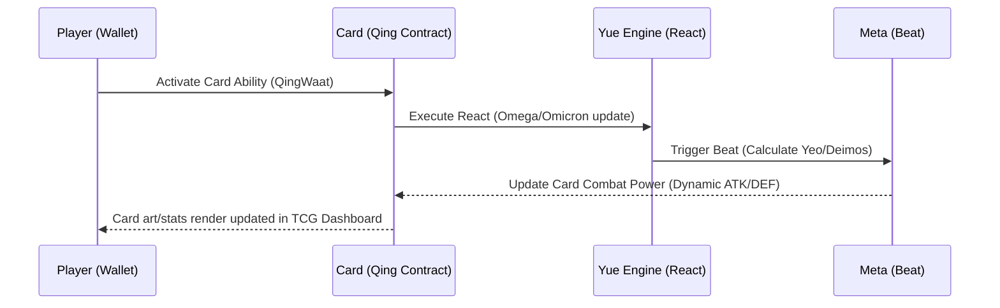

# Integrating On-Chain Math Outputs into TCG Card Design

With `ZI`, `PANG`, `RING`, and `META` contracts successfully running identical mathematical equations to PulseChain mainnet on our local EVM, we now have a rich set of dynamic variables generated during contract execution. 

In this game system, **every collectible card has an attached QING contract** (which functions as its on-chain liquidity/reaction pool). These values are mapped directly to gameplay attributes, combat parameters, and special ability modifiers.

---

## 1. Mapped Mathematical Variables to Card Stats

| On-Chain Output | Dysnomia Equation Origin | TCG Card Mechanics Integration |
|:---|:---|:---|
| **`Yeo`** (Non-zero) | `META.Beat` $\rightarrow$ `Chao / Yeo` | **Tempo / Initiative**: Represents the action priority or speed of the card's attached Qing during combat cycles. |
| **`Deimos`** | `META.Beat` $\rightarrow$ `modExp(Dione, Phoebe, Yuan(Qing))` | **Ultimate Ability Damage**: Functions as the ultimate strike value when a player invokes `Beat` on the card. |
| **`Chao`** | `RING.Eta` $\rightarrow$ `Yue.React(Phobos)` | **Field Multiplier / Synergy**: Modifies the stat scaling of adjacent friendly cards in the same domain. |
| **`Charge`** (Beat) | `META.Beat` $\rightarrow$ `Charge1 * Charge / Iota1` | **Mana / Action Points**: Used to fund the activation costs of secondary card abilities or deck spells. |
| **`Dione`** / **`Phoebe`** | `META.Beat` / `RING.Eta` | **Shield / Armor**: Determines the dynamic damage-reduction values for the card's active defenses. |

---

## 2. Dynamic Card Progression and Combat Loop

When a player triggers a reaction on their card, the values are updated in real-time on-chain, allowing for non-static gameplay:

This ensures that cards with attached Qings are not static collectibles, but instead carry a live, mathematically verified state directly driven by the on-chain engine.
