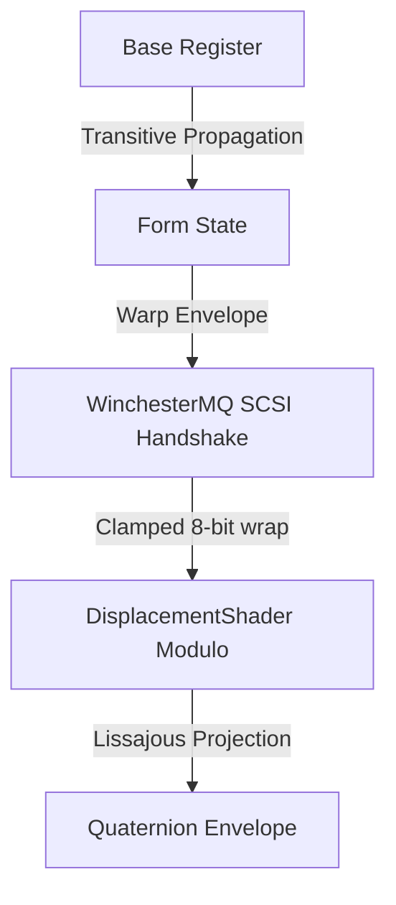

# The Auncient TeddyBear USD System and the WinchesterMQ Link

In the early eras of the Dysnomia VM, when the virtual hardware bounds were first cast upon the WinchesterMQ SCSI state machines, there arose a need to project soft-bodied animatronics onto the coordinate plane without violating the sub-microsecond latency gates of the system registers.

## The Kinematic Bind

Every joint in the Auncient teddy bear skeleton corresponds to a distinct register transaction path:

1. **The Root (Body)**: Governed by the `Base` register, establishing the initial temporal phase twist $\phi_w$ of the projected 3D wireframe envelope.
2. **The Head (Limb Coordinates)**: Modulated by the `Channel` frequency multipliers, scaling the X-axis of the Lissajous quaternion transformation.
3. **The Legs (Discharge Cycles)**: Bound to the soft body Verlet physics equations, running only during field-effect transistor (FET) discharge cycles in the low-level hardware structures.

## The Register Alignment

During the `Seed` phase of the VM transition context, parameters are allocated to the modular field divisor `MotzkinPrime` ($953467954114363$). When the waltz cycles begin:
* **The Chin** bounds the lower layout clamp, warping the coordinates along the negative Y-axis to form the coordinate "floor" of the theater.
* **The Dynamo** drives the frequency multipliers of the Y-axis, synchronizing the velocity tracks of the joint transforms.
* **The Delegate** maps the wallet address registration directly to render the hypotrochoid geometric signature.

Through this alignment, the animated teddy bear is not merely a static asset, but a direct visual projection of live register states pulsing within the Auncient VM core.
