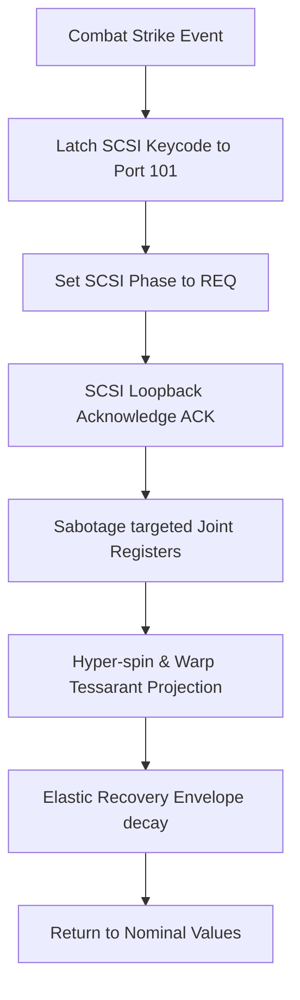

# Auncient Tessarant Combat Physics and Collision Specification

This document details the mechanics, physics equations, and low-level **Auncient** WinchesterMQ event routing that govern how 4D tessarant shapes deform, collide, and take damage within the 3D Arena.

---

## 1. Mathematical Foundation of Tessarant Physics

A tessarant is represented as a 4D hyper-volume defined by 16 vertices in $\mathbb{R}^4$:

$$V = \left\{ (x, y, z, w) \mid x, y, z, w \in \{-1, 1\} \right\}$$

### 4D Rotational Kinematics
Movement and deformation are driven by six independent planes of rotation ($XY, XZ, XW, YZ, YW, ZW$). Under nominal conditions, rotation angles evolve smoothly over time $t$:

$$\theta_{ij}(t) = \omega_{ij} \cdot t + \phi_{ij}$$

Where:
* $\omega_{ij}$ is the angular velocity in the $IJ$ plane.
* $\phi_{ij}$ is the phase offset mapped from the **Auncient** DNA sequence.

### Perspective Projection Pipeline
The 4D coordinates project to the 3D viewport using a dual-perspective camera model:
1. **4D to 3D Hyper-Projection**:
   $$x' = \frac{x}{d - w}, \quad y' = \frac{y}{d - w}, \quad z' = \frac{z}{d - w}$$
   Where $d$ is the hyper-perspective focal distance register (stored in `yulStorage[104]`).
2. **3D to 2D Screen Projection**:
   $$X_{scr} = X_{off} + \frac{x' \cdot f}{z'}, \quad Y_{scr} = Y_{off} + \frac{y' \cdot f}{z'}$$

---

## 2. WinchesterMQ Damage Mapping & Joint Sabotage

Tessarant deformation is controlled dynamically by the low-level **Auncient** WinchesterMQ bus registers. Each physical joint (Head, Ears, Paws, Feet) maps to a dedicated 10-byte segment in the emulated Yul memory map:

$$\text{Base Register Offset} = \text{JointIndex} \times 10$$

| Register Address | Function | Nominal Value | Combat Sabotage Value |
| :--- | :--- | :--- | :--- |
| `103 + Offset` | Clock Divisor (Damping) | `1000` | `160` (Hyper-spin) |
| `104 + Offset` | Focal Distance ($d$) | `2300` | `1350` (Warp/Deflate) |

### Damage Propagation Flow
When a combat hit is registered in the arena:
1. A collision payload is latched to SCSI Data Register `yulStorage[101]`.
2. The state machine transitions to Phase `1` (REQ), executing the loopback handshake.
3. The targeted joint offset is mutated instantly, forcing the corresponding tessarant to spin wildly and collapse inward.
4. The register values gradually recover back to nominal state via an envelope decay function, simulating material elasticity.

---

## 3. Collision Resolution in $\mathbb{R}^4$

Collisions are not merely calculated in 3D screen space; they are verified at the 4D hyper-frustum boundaries.

### Hyper-Sphere Bounding Volumes
Every joint is enveloped in a 4D hyper-sphere defined by:

$$(x - x_c)^2 + (y - y_c)^2 + (z - z_c)^2 + (w - w_c)^2 \le R^2$$

### Collision Detection Algorithm
1. Retrieve the position vectors $P_1, P_2 \in \mathbb{R}^4$ of two interacting joints.
2. Calculate the 4D Euclidean distance:
   $$D_{4D} = \sqrt{\sum_{i \in \{x,y,z,w\}} (P_{1,i} - P_{2,i})^2}$$
3. If $D_{4D} < R_1 + R_2$, a collision is triggered.
4. The overlap magnitude $\Delta = (R_1 + R_2) - D_{4D}$ is written back into the ZMM register bank to calculate kinetic energy transfer and health damage.

---

## 4. Multi-Tier LOD Integration

To maintain 60 FPS performance during heavy physics calculations, the engine dynamically adjusts simulation complexity:

> [!NOTE]
> **LOD 2 (Far Viewport Depth)**: Flat 2D skeleton rendering. Bypasses 4D rotation math, shadows, and physics entirely.
>
> **LOD 1 (Medium Viewport Depth)**: Simplified 3D cube model (8 vertices, 6 faces) with 3D rotational kinematics.
>
> **LOD 0 (Near Viewport Depth)**: Full 4D hypercube calculation (16 vertices, 24 cyclic faces) using 6-axis rotation, perspective projection, and joint warping.
