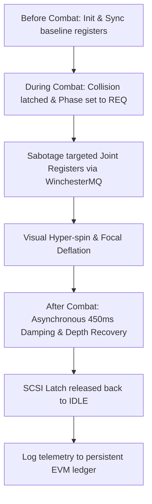

# Auncient Tessarant Combat Physics and Collision Specification

This document details the mechanics, physics equations, and low-level **Auncient** WinchesterMQ event routing that govern how 4D tessarant shapes deform, collide, and take damage within the 3D Arena.

---

## 1. Mathematical Foundation of Tessarant Physics

A tessarant is represented as a 4D hyper-volume defined by 16 vertices in 4D Space (R^4):

* **V = { (x, y, z, w) | x, y, z, w in {-1, 1} }**

### 4D Rotational Kinematics
Movement and deformation are driven by six independent planes of rotation (XY, XZ, XW, YZ, YW, ZW). Under nominal conditions, rotation angles (theta) evolve smoothly over time t:

* **theta_ij(t) = omega_ij * t + phi_ij**

Where:
* **omega_ij** is the angular velocity in the IJ plane.
* **phi_ij** is the phase offset mapped from the **Auncient** DNA sequence.

### Perspective Projection Pipeline
The 4D coordinates project to the 3D viewport using a dual-perspective camera model:
1. **4D to 3D Hyper-Projection**:
   * x' = x / (d - w)
   * y' = y / (d - w)
   * z' = z / (d - w)
   
   Where **d** is the hyper-perspective focal distance register (stored in `yulStorage[104]`).
2. **3D to 2D Screen Projection**:
   * X_scr = X_off + (x' * f) / z'
   * Y_scr = Y_off + (y' * f) / z'

---

## 2. WinchesterMQ Damage Mapping & Joint Sabotage

Tessarant deformation is controlled dynamically by the low-level **Auncient** WinchesterMQ bus registers. Each physical joint (Head, Ears, Paws, Feet) maps to a dedicated 10-byte segment in the emulated Yul memory map:

* **Base Register Offset = JointIndex * 10**

| Register Address | Function | Nominal Value | Combat Sabotage Value |
| :--- | :--- | :--- | :--- |
| `103 + Offset` | Clock Divisor (Damping) | `1000` | `160` (Hyper-spin) |
| `104 + Offset` | Focal Distance (d) | `2300` | `1350` (Warp/Deflate) |

### 2.1 Before Combat: Configuration & Calibration
Before combat matches begin, the **Auncient** WinchesterMQ message broker coordinates the baseline initialization sequence of each individual tessarant joint:
* **Pre-flight Sync**: A handshake loop is initialized via SCSI registers where `yulStorage[100]` (SCSI Phase) is set to `0` (IDLE).
* **Clock Damping Calibration**: The baseline rotation speed divisor (stored at `103 + Offset`) is calibrated according to the bear's active DNA metadata. Typically, this is set to a default value of `1000` to prevent early kinetic drift or instability.
* **Hyper-frustum Clamping**: The focal projection distance registry (stored at `104 + Offset`) is initialized to `2300` to ensure optimal spatial geometry layout before joints interact.
* **Liveness Heartbeats**: Loopback transaction registers (e.g. `yulStorage[105]`) are zeroed out and verified by running a mock SCSI echo pulse.

### 2.2 During Combat: Latching, Interrupts & Sabotage
During active combat, joints continuously monitor the SCSI interface for incoming collision packets:
* **Data Latching**: Upon impact, a collision event latches the target scancode to the SCSI Data latch register `yulStorage[101]`.
* **State Interruption**: The SCSI phase register `yulStorage[100]` immediately switches to `1` (REQ) to trigger a fast-path Yul hardware interrupt bypass.
* **Transient Sabotage**: The message broker routes the collision offset to the targeted joint's registers. The damping divisor `103 + Offset` is sabotaged down to `160`, inducing extreme hyper-spin. Concurrently, the focal depth register `104 + Offset` drops to `1350`, causing a structural deflation of the 4D hypercube vertices.
* **Visual Warping**: The frame presenter receives the warped registers and draws the deformed joints dynamically, providing high-fidelity visual indicator feedback of the impact.

### 2.3 After Combat: Recovery, Cooling & State Persistence
Once a collision/strike event finishes, the post-combat cycle handles the graceful return of the joints:
* **Elastic Recovery Envelope**: An asynchronous thread or Javascript timeout schedules register restoration. Damping and focal variables are gradually lerped or reset back to their baseline states (`1000` and `2300` respectively) over a `450ms` cooling curve.
* **SCSI Latch Release**: The SCSI status registers are set back to `0` (IDLE), clearing the bus for the next transaction.
* **State Persistence**: The cumulative damage transaction count (`yulStorage[105]`) is compiled and packaged alongside the battle ZIL tesseract parameters, saving the post-combat DNA mutation values into the persistent local storage for historical log auditing.

---

## 3. Collision Resolution in 4D Space (R^4)

Collisions are not merely calculated in 3D screen space; they are verified at the 4D hyper-frustum boundaries.

### Hyper-Sphere Bounding Volumes
Every joint is enveloped in a 4D hyper-sphere defined by:

* **(x - x_c)^2 + (y - y_c)^2 + (z - z_c)^2 + (w - w_c)^2 <= R^2**

### Collision Detection Algorithm
1. Retrieve the 4D position vectors P1, P2 of two interacting joints.
2. Calculate the 4D Euclidean distance:
   * **D_4D = sqrt( (P1.x - P2.x)^2 + (P1.y - P2.y)^2 + (P1.z - P2.z)^2 + (P1.w - P2.w)^2 )**
3. If **D_4D < R1 + R2**, a collision is triggered.
4. The overlap magnitude **Delta = (R1 + R2) - D_4D** is written back into the ZMM register bank to calculate kinetic energy transfer and health damage.

---

## 4. Multi-Tier LOD Integration

To maintain 60 FPS performance during heavy physics calculations, the engine dynamically adjusts simulation complexity:

> [!NOTE]
> **LOD 2 (Far Viewport Depth)**: Flat 2D skeleton rendering. Bypasses 4D rotation math, shadows, and physics entirely.
>
> **LOD 1 (Medium Viewport Depth)**: Simplified 3D cube model (8 vertices, 6 faces) with 3D rotational kinematics.
>
> **LOD 0 (Near Viewport Depth)**: Full 4D hypercube calculation (16 vertices, 24 cyclic faces) using 6-axis rotation, perspective projection, and joint warping.
