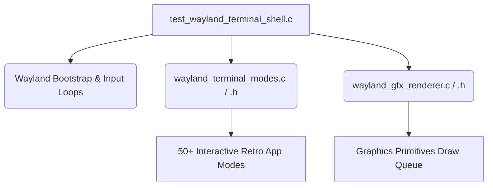

# Refactoring Plan: test_wayland_terminal_shell.c Decomposition

The current source file `test_wayland_terminal_shell.c` spans **13,842 lines (587KB)**. To comply with **Rule 8 (68KB File Limit)** and improve code modularity, we will decompose the file into smaller, specialized subcomponents.

---

## 1. Architectural Strategy

We will split the monolithic test source file into three modular components:



---

## 2. Proposed Modules

### Module A: `tsfi2-deepseek/tests/wayland_gfx_renderer.c` (.h)
* **Responsibility**: Custom pixel-buffer drawings, lines, circles, rounding rectangles, and 3D wireframe render loops.
* **Key Structures**: `GfxPrimitive`, `GfxType`, `gfx_primitives[1024]`.
* **Target Size**: ~40KB.

### Module B: `tsfi2-deepseek/tests/wayland_terminal_modes.c` (.h)
* **Responsibility**: Game loop states, simulations, inputs, and draw dispatchers for all 50+ interactive retro editor modes (e.g., `Alpiner`, `Checklist`, `SpacePatrol`, `Wordcraft`, `Pong`, `ZMachine`).
* **Target Size**: Since the modes span ~9,000 lines (~400KB), we will split them into modular groups (e.g. `wayland_terminal_modes_games.c` and `wayland_terminal_modes_editors.c`) to ensure each file remains strictly under **68KB**.

### Module C: `tsfi2-deepseek/tests/test_wayland_terminal_shell.c`
* **Responsibility**: Wayland connection loops, registry bindings, XDG Shell layout negotiations, keyboard listener callbacks, and main loop orchestration.
* **Target Size**: ~50KB.

---

## 3. Makefile Integration

We will update the `tsfi2-deepseek/Makefile` target compilation lines:
```diff
-$(BIN_DIR)/test_wayland_terminal_shell: tests/test_wayland_terminal_shell.c
-	$(CC) $(CFLAGS) $^ -o $@ $(LDFLAGS)
+$(BIN_DIR)/test_wayland_terminal_shell: tests/test_wayland_terminal_shell.c \
+                                        tests/wayland_gfx_renderer.c \
+                                        tests/wayland_terminal_modes_games.c \
+                                        tests/wayland_terminal_modes_editors.c
+	$(CC) $(CFLAGS) $^ -o $@ $(LDFLAGS)
```

---

## 4. Next Steps
1. Create header definitions for shared globals (e.g., `g_editor_mode`, `win_width`, `back_buffer`).
2. Proactively extract the graphics renderer module first.
3. Migrate the interactive modes block-by-block.
