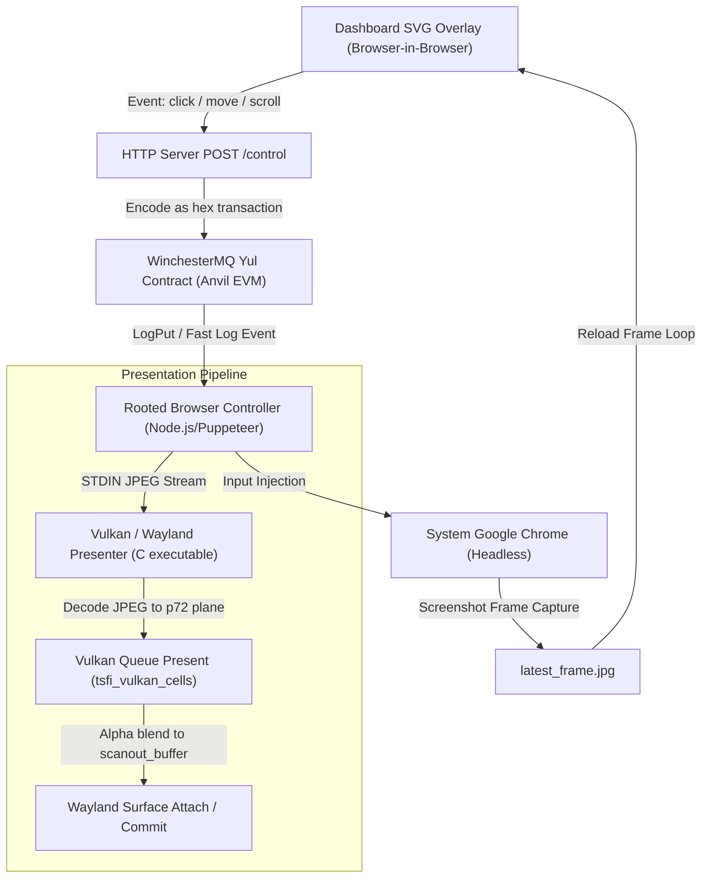
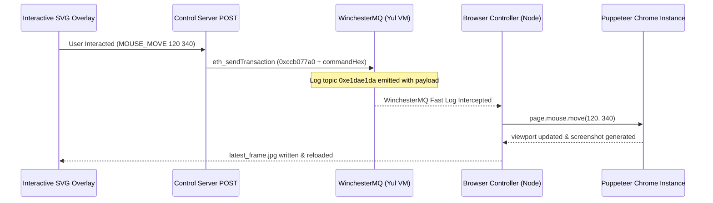
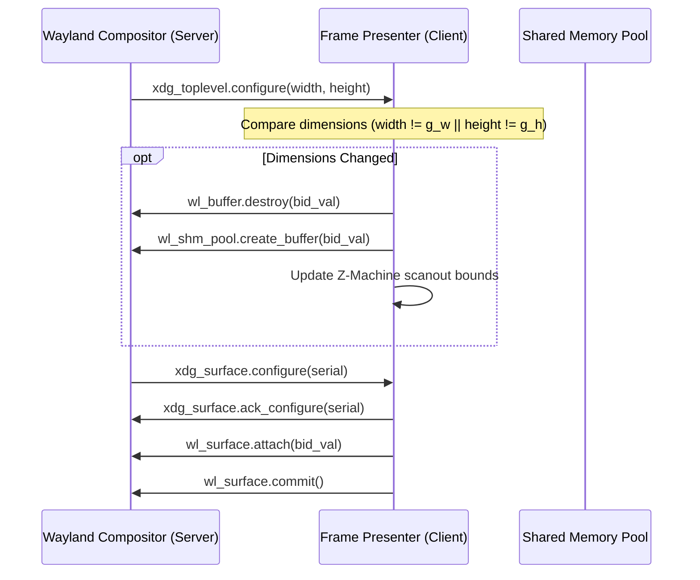

# Transcendent Control Framework Architecture

The **Transcendent Control Framework** is a unified execution architecture designed to interface low-overhead hardware interfaces, virtualized display compositors, and on-chain state transitions. It facilitates CPU input injection straight to the query fields and filters of nested sub-sessions.

---

## 1. Yul On-Chain Logic
The underlying communication backbone relies on contract components written in **Yul** (strict assembly) to bypass standard Solidity compiler overhead. Yul allows precise memory offsets and zero-overhead execution for event emission.

* **Target Selector (`0xccb077a0`)**: Fast-path transactions write directly to the hardware-mapped data port.
* **Low Gas Dispatches**: By avoiding high-level EVM abstractions, input routing transactions are executed with minimal gas, bypassing typical SCSI handshakes and allowing high-frequency input updates (up to 60 events/second).

---

## 2. WinchesterMQ (MQ) Messaging Queue
WinchesterMQ acts as the on-chain message broker. Input commands (e.g., mouse movement coordinates, keycodes, clicks, and page scrolls) are dispatched as transaction data payloads targeting the WinchesterMQ deployment address:

* **Handshake Mode**: Larger command buffers are stored in contract storage slots starting at offset `0x1000 + blockId` and emitted via `LogPut` events.
* **Fast Log Mode**: Emits events using a dedicated log topic hash (`0xe1dae1da...`) containing the exact ASCII representations of the input command in the transaction body.
* **Listener Module**: The `rooted_browser_controller.js` listens to logs matching these topics, extracts the transaction inputs, and dynamically routes them to the corresponding interactive sub-sessions.

### On-Chain Fast-Path Transaction Layout
To bypass standard Solidity function signature overhead, the fast path uses a 32-byte payload aligned to the hardware data port:

| Offset (Bytes) | Data Type | Field Description | Example Value |
| :--- | :--- | :--- | :--- |
| `0x00 - 0x03` | `bytes4` | Target Function Selector | `0xccb077a0` |
| `0x04 - 0x23` | `bytes32` | UTF-8 Command Payload (Right-padded) | `0x73657263682050756c7365436861696e...` |

### WinchesterMQ Event Dispatch Sequence

---

## 3. Z-Machine VM Integration
For virtual machine state transitions, the dashboard feeds inputs into the Z-Machine virtual memory space:

* **Memory Slot Allocation**: Registers mapped to standard memory slots (such as `0x1000 + blockId`) are dynamically checked during the VM execution step cycles.
* **Handshake Synchronization**: When a command is routed to the Z-Machine sub-session, the interface performs an EVM status check to verify the transaction receipt before advancing the VM instruction pointer, guaranteeing synchronization between the on-chain database and local display composition.

---

## 4. Browser-in-Browser (Picture-in-Picture) Routing
To achieve seamless nesting without layout conflicts, the dashboard uses a **Browser-in-Browser (BiB)** overlay mechanism:

* **Frame Capture**: Headless Puppeteer browser sub-sessions capture screenshot frames at 75% JPEG quality.
* **Layout Streaming**: The frames are written to a shared directory (`frontend/latest_frame.jpg`) and reloaded dynamically inside the SVG viewport of the parent dashboard page.
* **SVG Interactive Overlay**: An SVG overlay intercepts mouse clicks and movements on the client interface and maps local coordinate boxes to Puppeteer viewport coordinates. The mapped events are forwarded back as WinchesterMQ messages.

### Interactive Viewport Coordinate Mapping
When interactions occur on the SVG viewport overlay, local display coordinates must be mapped back to the Puppeteer layout space. The client maps client bounds scaling using the following formulas:

$$X_{\text{target}} = \text{round}\left((X_{\text{client}} - \text{Left}_{\text{rect}}) \times \frac{800}{\text{Width}_{\text{rect}}}\right)$$
$$Y_{\text{target}} = \text{round}\left((Y_{\text{client}} - \text{Top}_{\text{rect}}) \times \frac{600}{\text{Height}_{\text{rect}}}\right)$$

This maps arbitrary SVG display dimensions back onto the canonical $800 \times 600$ viewport size.

---

## 5. Keyboard Translation Specifications
Raw keyboard event codes capture standard Linux evdev keycodes generated by Wayland seat clients. These are translated on-the-fly into Puppeteer-recognized keyboard input keys:

| Linux Evdev Keycode | Wayland Key Value | Puppeteer Keyboard Target |
| :--- | :--- | :--- |
| `1` | `KEY_ESC` | `'Escape'` |
| `14` | `KEY_BACKSPACE` | `'Backspace'` |
| `28` | `KEY_ENTER` | `'Enter'` |
| `30` | `KEY_A` | `'a'` |
| `42` | `KEY_LEFTSHIFT` | `'Shift'` |
| `57` | `KEY_SPACE` | `' '` |
| `103` | `KEY_UP` | `'ArrowUp'` |
| `108` | `KEY_DOWN` | `'ArrowDown'` |

---

## 6. Vulkan Virtual Planes
For low-level hardware rendering, the presentation pipeline uses **Auncient** DRM/ZMM virtual planes:

* **Virtual Plane Allocation**: Registers a virtual display plane (ID `72`) using `tsfi_drmModeAddPlane`.
* **JPEG Decoder Routing**: The STDIN-piped screenshots are decoded into the raw virtual plane buffer `p72` (`tsfi_drmModeGetVirtualPlaneBuffer(72)`).
* **Mock Presentation**: Calling `vkQueuePresentKHR` initiates a mock rendering queue. The Vulkan cells compositor performs alpha blending of all registered active planes onto the final `g_scanout_buffer` background.

---

## 7. Wayland Client Interface
The compositor windowing uses Wayland protocols to remain lightweight and platform-independent:

* **Configure Resizing**: The presenter handles `xdg_toplevel` configure events. When the compositor triggers a resize, the presenter dynamically destroys and reconstructs the shared memory (`wl_shm_pool`) buffer (`wl_buffer`) to match the new dimensions.
* **Stability Safeguard**: Re-creation only occurs if the configure dimensions differ from the current layout (`width != g_w || height != g_h`). This prevents compositor crashes due to race conditions during configure acknowledge (`xdg_surface.ack_configure`) sequences.
* **Buffer Allocation Limits**: The shared memory pool is dynamically sized up to `3840 * 2160 * 4` bytes, ensuring safe buffer allocation on displays up to 4K.

### Wayland Configure Acknowledge Sequence

---

## 8. Latency Tuning & Performance Controls
To maintain interactive frame rates over WinchesterMQ dispatches, the following parameters are dynamically tuned:

* **JPEG Quality Constraints**: Capture screenshot frames at a default quality of `75%`. Increasing this creates significant network congestion under JSON-RPC loops, while decreasing it limits character readability.
* **Frame Skip Optimization**: Standard dashboard views update on a frame-skip factor of 30 ($~2$ fps) when idle, while active video streaming triggers a fast bypass loop ($~20$ fps) to minimize interaction lag.
