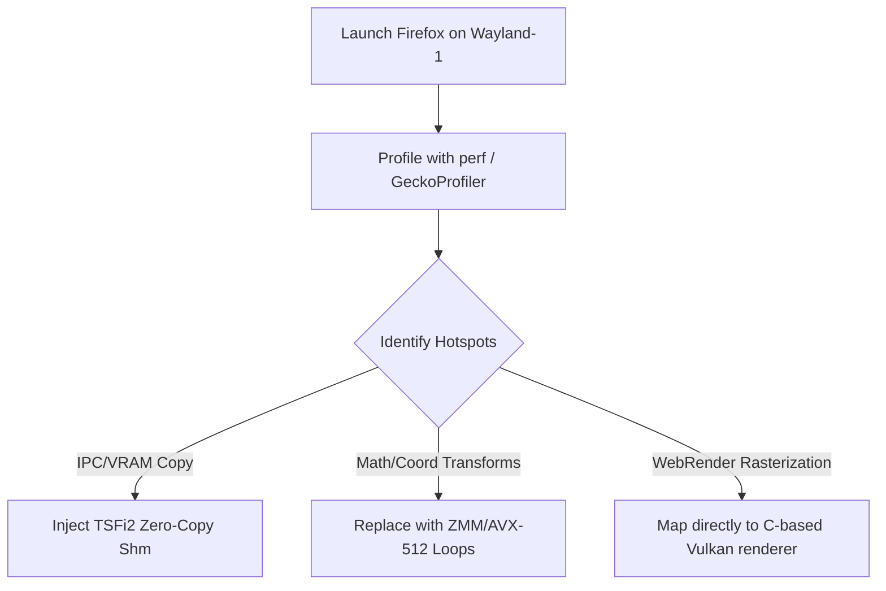

# TSFi2 Integration & Mozilla Engine Reduction Plan

This plan details the implementation strategy for building TSFi2's high-efficiency C-based components directly into the Mozilla Firefox source tree, tracing optimization candidates, and replacing Rust-based modules.

## 1. Trace and Profiling Framework

To understand Gecko's runtime bottlenecks, we will use profiling tools on the newly compiled baseline binary:

### Hotspot Tracing Targets:
1. **GPU Texture Uploads (`gfx/layers/ipc/`):** Track the pipeline rendering YouTube video frames. We will trace the allocation path of `DMABufSurface` and verify if it matches our VRAM zero-copy models (`lau_vram.c`).
2. **Layout Math Calculations (`gfx/2d/`):** Profile vector transformations, clipping, and coordinate mappings. These are candidates for acceleration using ZMM register instructions (`tsfi_opt_zmm.c`).

---

## 2. Porting C-Based TSFi2 Modules into Mozilla

To avoid using any Rust code inside TSFi2 and to ultimately remove Rust dependencies from the browser engine, we can integrate the following C modules directly into Mozilla's C++ entry points:

### A. Core Math and Transforming
* **Module:** `tsfi_opt_zmm.c` / `tsfi_vec_math.c`
* **Gecko Integration Point:** `gfx/2d/Matrix.h` and transform helpers inside `gfx/skia/`.
* **Method:** Replace standard CPU matrix multiply loops with AVX-512 ZMM SIMD operations, achieving massive layout computation efficiency.

### B. Compositor Blending & Wavelet Compression
* **Module:** `tsfi_fourier.c` / `tsfi_math.c`
* **Gecko Integration Point:** `RenderThread.cpp` / WebRender bindings.
* **Method:** Route offscreen framebuffers directly through our **Auncient** Wavelet formulations to perform compressed compositing inside VRAM before swapchain presentation.

### C. Direct WSI Client Hooking
* **Module:** `vulkan_init.c` / `vulkan_main.c`
* **Gecko Integration Point:** `widget/gtk/nsWindowWayland.cpp`
* **Method:** Intercept the Wayland surface initialization, passing native file descriptors (DMA-BUF handles) directly to our Vulkan pipeline.

---

## 3. Road toward a Pure C Minimal Renderer

By using this integration to learn Gecko's layout tree serialization:
1. **Dumping Display Lists:** Hook into the display list builder (`nsDisplayList.cpp`) to dump serialized drawing commands.
2. **Bypassing WebRender:** Write a C-based backend in Mozilla that consumes these commands directly, feeding them into TSFi2's C-based font and shape rasterizers (`tsfi_font_engine.c` / `tsfi_pbr.c`).
3. **Decoupling Rust:** Once the C backend replaces WebRender, we can turn off Rust compilation in `.mozconfig`, leaving a highly optimized, lean browser engine built upon the pure C foundation of TSFi2.
