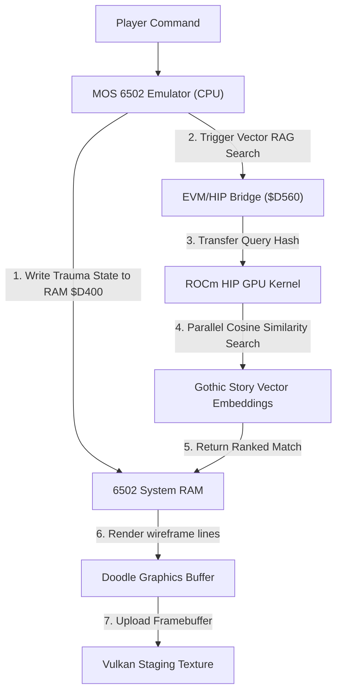

# Unreal Vaesen Mystery House: 6502 & ROCm Hybrid Architecture

This specification outlines the hybrid integration of the **MOS 6502 Emulator** (running the core game state and player trauma logic) and the **ROCm (AMD HIP) GPU Accelerator** (powering parallel RAG database scans and real-time vector coordinate projection). By bridging these two architectures, we achieve authentic retro interactive fiction execution coupled with state-of-the-art high-dimensional AI story mapping.


---

## 1. System Topology Overview

The hybrid game engine splits execution between the sequential 8-bit registers of the 6502 and the parallel GPU compute wavefronts of ROCm:



---

## 2. 6502 Memory Map & Vaesen Trauma Registry

Core player parameters, game screens, and retro sound cues are mapped into the Zero Page and specialized memory-mapped I/O zones:

| Memory Address (6502 hex) | Registry Name | Type | Description |
| :--- | :--- | :--- | :--- |
| `$0010` | `PLAYER_ROOM` | `byte` | Active room index (0 = House Exterior, 1 = Foyer, 2 = Parlor, 3 = Portal) |
| `$D400` | `PHYS_TRAUMA` | `byte` | Vaesen physical trauma level (0 = Normal, 1 = Exhausted, 2 = Battered, 3 = Broken) |
| `$D401` | `MENT_TRAUMA` | `byte` | Vaesen mental trauma level (0 = Normal, 1 = Shaken, 2 = Terrified, 3 = Panicked) |
| `$D402` | `JOYSTICK` | `byte` | Joystick state inputs mapped diagonally |
| `$D560` | `HIP_CALL_TRIGGER`| `byte` | Writing `$01` triggers high-speed ROCm compute dispatch |
| `$D561`–`$D57F` | `HIP_QUERY_HASH` | `32 bytes` | Keccak-256 hash of the parser query to project into ROCm vector space |

---

## 3. ROCm (HIP) Parallel Cosine Similarity Kernel

The ROCm GPU parallelizes the search across thousands of story nodes and gothic dialogue options. A query vector (generated from the player's text command) is compared against pre-loaded story embeddings using dot-product similarity:

```cpp
#include <hip/hip_runtime.h>

// HIP Kernel to perform parallel dot-product cosine similarity searches
__global__ void roc_story_rag_similarity(
    const float* __restrict__ query_vector,
    const float* __restrict__ db_vectors,
    float* __restrict__ scores,
    const int vector_dim,
    const int num_story_nodes
) {
    int node_idx = blockIdx.x * blockDim.x + threadIdx.x;
    if (node_idx >= num_story_nodes) return;

    float dot_product = 0.0f;
    int offset = node_idx * vector_dim;

    // Unrolled vector processing for AMD wavefront execution (64-wide)
    for (int i = 0; i < vector_dim; i++) {
        dot_product += query_vector[i] * db_vectors[offset + i];
    }

    scores[node_idx] = dot_product;
}
```

---

## 4. 6502 Assembly Interface & Game Loop

This assembly snippet shows how the 6502 game loop updates player coordinates, writes trauma states to RAM, and polls the ROCm/HIP accelerator:

```assembly
; ========================================================
; UNREAL VAESEN MYSTERY HOUSE - MAIN CORE STATE LOOP
; ========================================================

* = $C000               ; Start assembly execution

START   JSR INIT_ROOM    ; Initialize starting room
LOOP    JSR READ_JOY     ; Read Zero Page joystick values
        LDA $D401        ; Load Mental Trauma Level
        CMP #$03         ; Is player Panicked?
        BEQ PANIC_SHIVER ; If yes, skip to panic jitter handling
        
UPDATE  JSR PHYS_UPDATE  ; Apply fatigue delay
        JSR DRAW_SCENE   ; Draw the vector wireframe
        JMP LOOP         ; Loop infinitely

PANIC_SHIVER
        JSR RANDOM_JIT   ; Calculate rapid screen jitter coordinates
        JSR DRAW_SCENE
        JMP LOOP

; --- Trigger GPU Dispatch ---
TRIGGER_ROCM
        LDX #$00
WRITE_HASH
        LDA HASH_BUF, X  ; Load hash segment
        STA $D561, X     ; Write to GPU communication area
        INX
        CPX #$20
        BNE WRITE_HASH
        
        LDA #$01
        STA $D560        ; Write 1 to launch ROCm kernel
        RTS
```

---

## 5. Visual Rendering Coordination

> [!NOTE]
> All coordinates are represented as 5-byte packed structures (`fromX, fromY, toX, toY, colorCode`).

1. **Vector Projection**: The active room index from Zero Page `$0010` is loaded. If a ROCm scene update is active, the GPU transforms room coordinates (applying rotation/scaling matrices in parallel) and writes the results back to the C64 Doodle framebuffer.
2. **Consensus Synchronization**: The C host verification harness reads the generated frame, hashes the frame using AVX-512 registries, and validates it against the active EVM transaction block to ensure consensus.
