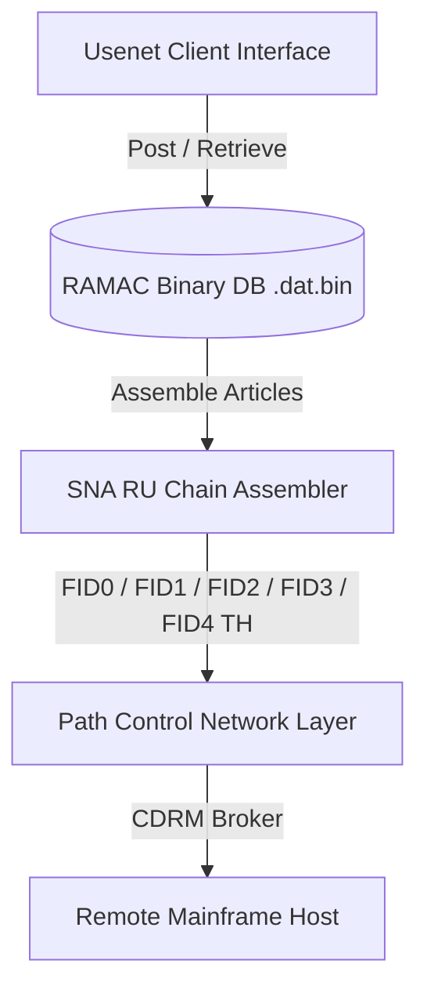

# Usenet over SNA Support Plan

This document outlines the technical design, protocol mappings, and implementation steps to support Usenet article storage, replication, and newsgroup distribution over standard IBM System Network Architecture (SNA) structures.

## 1. Protocol Mapping Layer



### Protocol Alignment
* **Newsgroups to Logical Units (LUs)**: Newsgroups map cleanly to distinct Logical Units (e.g. `net.general` -> `LU_TYPE_FILE`).
* **Articles to Request Units (RUs)**: Raw news posts are stored as binary payloads within standard Path Information Units (PIUs).
* **Fragmentation to RU Chaining**: Posts exceeding standard message sizes utilize RU Chain Assembler flags (`FIC`, `MIC`, `LIC`).
* **Active Feeds to CDRM Routing**: Cross-Domain Resource Manager (CDRM) sessions automatically synchronize indices of local binary structures using sequence numbers.

## 2. Binary Storage & Schema
Articles are serialized directly to standard binary formats (`.dat.bin` extensions). The layout preserves fixed field boundaries to maintain VM performance constraints:

```c
typedef struct {
    char newsgroup[64];
    uint32_t article_number;
    char subject[64];
    char body[256];
} tsfi_usenet_article;
```

## 3. Implementation Milestones

### Phase 1: Serialization Foundations (Completed)
- [x] Define `tsfi_usenet_article` layout.
- [x] Write binary encoders and decoders.
- [x] Verify storage and retrieval using unit tests.

### Phase 2: Session Integration & Routing (Planned)
- [ ] Connect article transfer hooks directly to `tsfi_sna_package_piu`.
- [ ] Implement group subscription matching using PU/LU address routing maps.
- [ ] Introduce dynamic flow pacing to prevent news floods.

### Phase 3: Cross-Domain Replications (Planned)
- [ ] Deploy active-feed loops via CDRM cross-domain bridges.
- [ ] Implement historical sequence checks to prevent duplicate transmissions.
