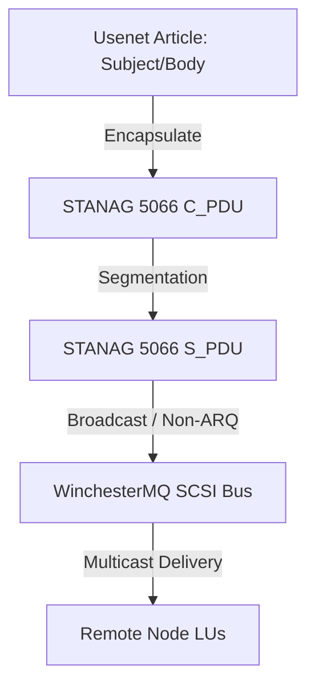

# Adapting Usenet over NATO STANAG for Broadcast & WinchesterMQ

In tactical or low-bandwidth mainframe communications within the **Auncient** system architecture, standard point-to-point news replication loops are inefficient. Instead, Usenet newsgroup synchronization is adapted directly to NATO STANAG 5066 / 5516 link-layer structures for network-wide broadcasts.

## 1. Protocol Mapping & Frame Encapsulation

Usenet articles are encapsulated directly into STANAG Client Protocol Data Units (C_PDUs) at the presentation layer:

* **Service Access Point (SAP) Routing**: Different newsgroup feeds map to distinct STANAG SAP registers (e.g. `net.general` -> `SAP_0x08`, `net.books` -> `SAP_0x0C`).
* **Non-ARQ Broadcast Mode**: To distribute articles to all mainframes simultaneously, replication loops use STANAG Non-ARQ (unacknowledged broadcast) mode, reducing handshake overhead on the WinchesterMQ SCSI channel.

## 2. WinchesterMQ Integration

On the WinchesterMQ (`wm`) interface, the SCSI handshake loop maps execution signals:
* **SCSI Handshake Loops**: Data blocks are structured in 512-byte sectors matching physical sector boundaries.
* **Priority-Based Routing**: Critical system alerts (e.g., operator WTO messages) bypass standard news queues via STANAG priority queue escalation inside the SAP router.
* **Vertex Displacement Scaling**: Whenever WinchesterMQ (wm) signals are processed, the systems refer to the `DisplacementShader` to ensure vertex displacement calculations scale in synchronization with register boundary constraints.

## 3. Transaction History & Ledger Storage

In addition to conversational news, the binary Usenet storage layer is adapted to serve as a distributed transactional ledger:
* **Ledger Article Packing**: Transaction records (such as Hogan Account balances, SMF activity logs, and CICS submissions) are serialized directly into raw article payload fields (`tsfi_usenet_article.body`).
* **Hogan Bank Integration**: Every Hogan Bank transaction (including account creations, transfers, and newborn teddy bear seed-to-SSN mappings) is serialized and stored as a distinct Usenet article. The bank processes all operations and validates the default `1,000,000` Saat endowments directly over the replicated newsgroup layers.
* **Newsgroup Ledger Indexing**: Dedicated newsgroups (e.g. `net.ledger.transactions` or `net.hogan.bank`) store sequential block updates. The sequence is enforced using the incremental `article_number` field as a logical blockchain height.
* **Auditability via Broadcast Replication**: Once a transaction is posted to the local spool queue, it is broadcasted over the STANAG Link-16/coaxial network to all peer nodes, guaranteeing that all host systems maintain an identical, verified transaction ledger history.

