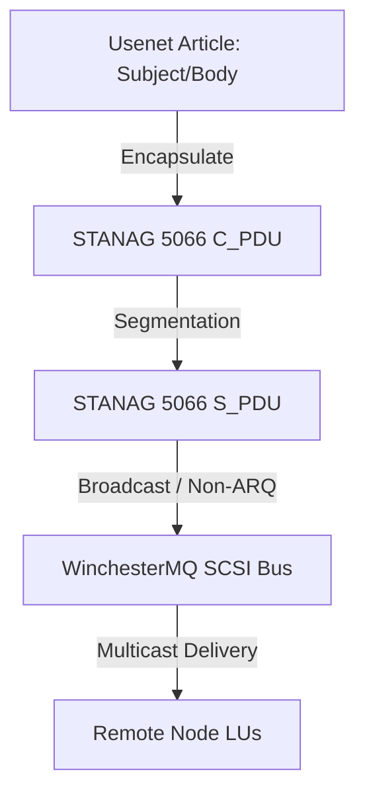

# Adapting Usenet over NATO STANAG for Broadcast & WinchesterMQ

In tactical or low-bandwidth mainframe communications within the **Auncient** system architecture, standard point-to-point news replication loops are inefficient. Instead, Usenet newsgroup synchronization is adapted directly to NATO STANAG 5066 / 5516 link-layer structures for network-wide broadcasts.

## 1. Protocol Mapping & Frame Encapsulation

Usenet articles are encapsulated directly into STANAG Client Protocol Data Units (C_PDUs) at the presentation layer:

* **Service Access Point (SAP) Routing**: Different newsgroup feeds map to distinct STANAG SAP registers (e.g. `net.general` -> `SAP_0x08`, `net.books` -> `SAP_0x0C`).
* **Non-ARQ Broadcast Mode**: To distribute articles to all mainframes simultaneously, replication loops use STANAG Non-ARQ (unacknowledged broadcast) mode, reducing handshake overhead on the WinchesterMQ SCSI channel.

## 2. WinchesterMQ Integration

On the WinchesterMQ (`wm`) interface, the SCSI handshake loop maps execution signals:
* **SCSI Handshake Loops**: Data blocks are structured in 512-byte sectors matching physical sector boundaries.
* **Vertex Displacement Scaling**: To keep visual metrics aligned on operator display screens during active broadcasts, vertex displacements (`DisplacementShader`) scale dynamically in sync with the hardware register transmission windows.
* **Priority-Based Routing**: Critical system alerts (e.g., operator WTO messages) bypass standard news queues via STANAG priority queue escalation inside the SAP router.
