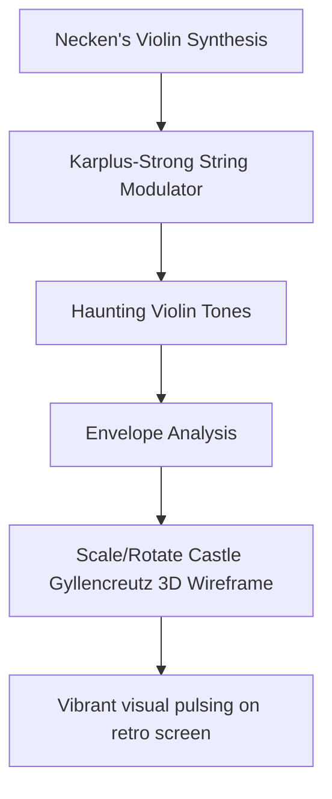

# Vaesen: Nordic Horror Audio-Visual Synthesis

This document outlines the thematic redesign and implementation plan to adapt the **TSFi2 Synthesis Studio** to the folklore and atmosphere of **Vaesen (Nordic Horror)**. We combine physical models of traditional instruments with 3D wireframe vector models of key setting structures.

---

## 1. Folklore Audio-Visual Pipeline

To capture the eerie, atmospheric nature of Vaesen, we map physical string simulations and heavy percussion to 3D architectural projections:



---

## 2. Instrument & Visual Specifications

### Haunting Instruments (Acoustics)
1. **The Necken's Violin**: Uses a **Karplus-Strong string synthesis** algorithm containing a feedback delay-line and low-pass filter to generate organic, bowed-string tones that mimic a haunted Swedish violin.
2. **Troll Drums (Heavy Percussion)**: A sequence of low-frequency, filtered noise bursts simulating heavy footsteps in the dark forests of Upsala.

### Setting Structure (Graphics)
*   **Castle Gyllencreutz**: The headquarters of the Society in Upsala. Projected as a 3D wireframe vector model.
*   **Acoustic Link**: The height and rotation speed of the castle's towers scale dynamically with the amplitude of the Necken's violin envelope.

---

## 3. Yul Karplus-Strong String Synthesizer

Below is the Yul implementation for the Necken's violin synthesis, simulating a plucked or bowed string by running noise through a feedback delay line:

```yul
// Method 42: synthesizeNeckenViolin(uint256 bufferAddr, uint256 delayLength, uint256 duration)
// Selector: 0x9f1a0e5b
if eq(selector, 0x9f1a0e5b) {
    let bufferAddr := calldataload(4)
    let delayLength := calldataload(36)
    let duration := calldataload(68)

    // Step 1: Initialize delay line with white noise (exciting the string)
    // Delay line buffer stored at 0x4000
    let delayLineAddr := 0x4000
    for { let i := 0 } lt(i, delayLength) { i := add(i, 1) } {
        let randomNoise := pseudoRandomNoise(i)
        mstore(add(delayLineAddr, mul(i, 32)), randomNoise)
    }

    // Step 2: Feed delay line back on itself with a lowpass filter (string damping)
    let readPtr := 0
    for { let sampleIdx := 0 } lt(sampleIdx, duration) { sampleIdx := add(sampleIdx, 1) } {
        // Read current sample and next sample
        let currentSample := mload(add(delayLineAddr, mul(readPtr, 32)))
        let nextPtr := mod(add(readPtr, 1), delayLength)
        let nextSample := mload(add(delayLineAddr, mul(nextPtr, 32)))

        // Simple moving average lowpass filter: out = (current + next) * 0.495 (decay)
        let filteredVal := sdiv(mul(add(currentSample, nextSample), 495), 1000)

        // Write back to delay line (feedback loop)
        mstore(add(delayLineAddr, mul(readPtr, 32)), filteredVal)

        // Save output sample
        mstore(add(bufferAddr, mul(sampleIdx, 32)), filteredVal)

        // Advance read pointer
        readPtr := nextPtr
    }

    mstore(0x00, duration)
    return(0x00, 32)
}

function pseudoRandomNoise(seed) -> val {
    // Linear Congruential Generator (LCG) output scaled to [-1000, 1000]
    let lcg := add(mul(seed, 1103515245), 12345)
    val := sub(mod(lcg, 2001), 1000)
}
```

---

## 4. Atmospheric Visuals
*   **The Upsala Observatory**: Projects circular telescope cupolas and stone towers in perspective vector lines.
*   **Folk Melodies**: The sequencer triggers minor-key folk intervals, creating an authentic Nordic mood.

---

## 5. Conclusion

Structuring the studio around Vaesen maps Scandinavian folklore into synthesis structures. Using Karplus-Strong string models alongside vector wireframes of historic Upsala castles, we create a rich, cohesive audio-visual Nordic horror atmosphere.
