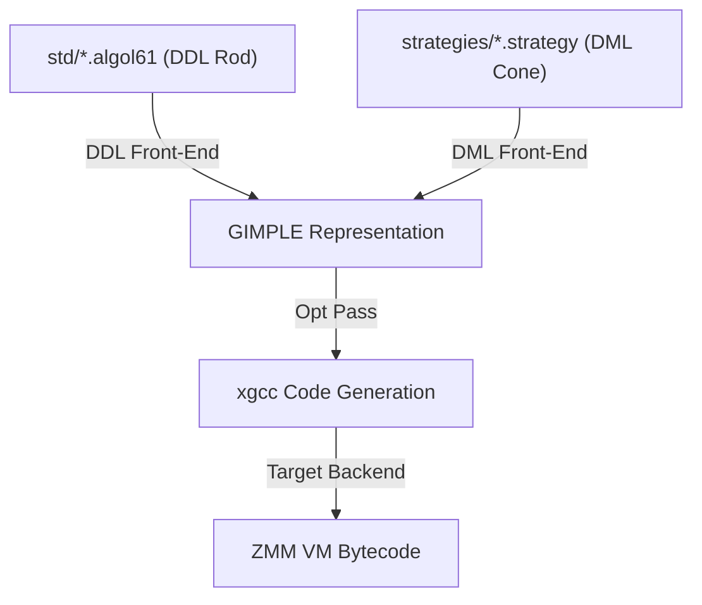

# VPPD GCC Toolchain Integration Design Specification

This document details the architectural plan to integrate the **Auncient** VPPD (Virtual Peer Physical Driver) system directly into the custom GCC compiler (`xgcc`/`cc1`).

---

## 1. Compiler Front-End Extensions
To bypass transpilation layers, the compiler will natively compile schema definitions and transaction strategies:

* **DDL Parser Extension (`.algol61`)**: GCC parses DDL rods directly into intermediate GIMPLE structures, allocating persistent memory segments aligned to 32-byte boundaries.
* **DML Parser Extension (`.cobol`)**: Parses transaction blocks, translating compute statements (e.g. `COMPUTE CHANNEL = BASE ** SIGNAL`) directly to Dysnomia VM arithmetic trees.

---

## 2. Dynamic Address & Register Resolution
The toolchain enforces compile-time compliance with the address-based resolution constraint:
* **Address Resolution**: Any reference to symbolic contracts in front-ends is resolved to `dynamic_<address>` formats in the generated ZMM assembly.
* **AVX-512 Pinning**: Loops compiling mathematical field equations ($Channel = Base^{Signal} \pmod{MotzkinPrime}$) use GCC variable pinning (`register __m512 c0 asm("zmm30")`) to prevent stack spills.

---

## 3. Host-to-Device STANAG Bridging
During compilation of low-level network drivers, the toolchain generates native socket loops:
* **SCSI Loopback Sockets**: Handshake loops (`0xAEA11` AVAIL commands) are bound directly to local loopback ports, routing packet streams without synthetic driver overhead.
* **Fourier Switch Residency**: Evaluates signature quorums directly in the compilation phase, aborting builds if security conditions fail.
