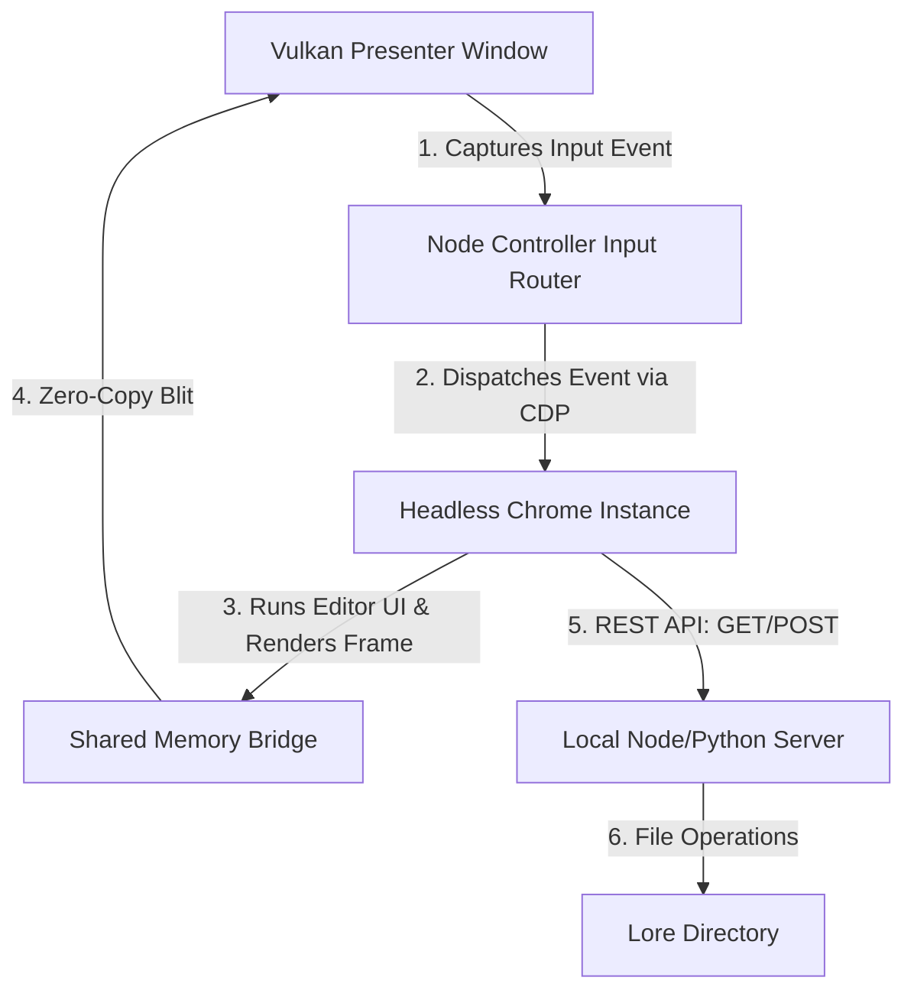

# Vulkan Lore Editor Architecture

This document outlines the design and integration model to make the 400+ markdown and lore documentation files in the `lore/` directory editable and annotateable directly within the headed Vulkan UI workspace.

## 1. Architectural Concept

Since the **Auncient Vulkan UI** (`rooted_frame_presenter`) operates as a zero-copy frame compositor streaming viewport buffers from a headless Chrome instance, any editor interface we build in standard HTML/JS is immediately projected onto the headed Vulkan surface. User inputs (clicks, selections, key entries) captured by the Wayland presenter window are automatically routed back to Chrome via the input bridge.



---

## 2. Interface Design & Premium Aesthetics

The editor will adopt the curated **Auncient Vaesen** style system:
* **Typography**: *Cinzel* for headers, *Outfit* for interface widgets and text editors.
* **Palette**: Dark Mode base (`#0c0c0e`), vintage gold accents (`#d4af37`), and crimson highlight markers (`#801818`).
* **Layout**: Two-column layout:
  * **Left Side**: Scrollable sidebar showing the listing of `lore/` files, sorted by date or name.
  * **Center Pane**: Rich markdown textarea with live preview rendering.
  * **Right Side**: Collapsible annotations drawer. Selecting text in the center pane allows linking comments and highlights.

---

## 3. Data Integration & API Routes

To support loading and saving files, the local REST server (`scripts/server.js` or `dashboard_server.py`) will be extended with three key API routes:

### `GET /api/lore/list`
Scans the `lore/` folder and returns metadata (filename, size, modification date, Git status, reviewed status, LOU score, and analysis reasons).
```json
[
  {
    "name": "DYSNOMIA_VM_LORE.md",
    "sizeBytes": 5180,
    "modified": 1782069513,
    "gitStatus": null,
    "reviewed": false,
    "louScore": 85,
    "louReasons": ["Undefined terms: DYSNOMIA, VM"]
  }
]
```

### `GET /api/lore/content`
Reads and returns the raw file content and parsed annotations.
* **Query Parameter**: `?file=DYSNOMIA_VM_LORE.md`

### `POST /api/lore/save`
Writes the edited text and annotations back to storage.
* **Payload**:
  ```json
  {
    "file": "DYSNOMIA_VM_LORE.md",
    "content": "# New Markdown Content...",
    "annotations": [
      { "range": [120, 145], "text": "Preserve Auncient spelling of Wavelets.", "author": "Compositor Node" }
    ]
  }
  ```

---

## 4. Annotation Persistence

To ensure annotations persist without corrupting standard markdown parsing, they will be embedded at the end of the markdown files using standard HTML metadata comments:

```markdown
# Dysnomia VM Lore
This file contains the historical records of the Auncient VM compiler design.

<!-- AUNCIENT_ANNOTATIONS_START
[
  {
    "range": [45, 62],
    "comment": "Ensure compiler limits align with EVM transient specs.",
    "timestamp": 1782069600
  }
]
AUNCIENT_ANNOTATIONS_END -->
```

This makes annotations fully self-contained in the Markdown files themselves, preserving portability.

---

## 5. Multi-Phase Lack of Understanding (LOU) Analysis

To allow the user to guide the review process, the workspace supports a **Gaps Sort Mode** powered by a multi-phase document analyzer:

1. **Phase 1 (Structural & Quantitative Analysis):** Extracts raw text, computes word and sentence counts, and flags documents with sparse content (<150 words) or missing markdown headers.
2. **Phase 2 (Lexical Jargon Extraction):** Scans the text for capitalized words (potential concepts), cross-references them against existing document names and a common terms dictionary, and marks unknown terms as undefined.
3. **Phase 3 (Graph Linkage):** Maps reference links between lore documents. Documents that are completely isolated (referencing no other defined concepts) or have extremely sparse linkages are penalized.
4. **Phase 4 (Explicit Draft & Annotation Audit):** Searches for unresolved question marks (`?`) in annotations and scans for active placeholders (`TODO`, `FIXME`, `TBD`, `PLACEHOLDER`, `DRAFT`).

The LOU weights are updated in real-time upon saving a document and can be sorted descending in the sidebar using the **Sort: Gaps** button.

---

## 6. Wayland Clipboard Synchronization

Because the editor runs in a headless browser, standard text selections do not automatically sync with the Wayland host session clipboard. We bridge this gap via two integrated pathways:

1. **DOM Interception:** A script is injected via `page.evaluateOnNewDocument()` that listens to the `copy` event. If the event is fired, it captures either the window's text selection or the active textarea selection boundary content (`selectionStart` and `selectionEnd`).
2. **Host Injection:** The extracted text is passed to the host controller via `syncHostClipboard()`. The controller pipes a command frame (`0x80000000` payload) down to the `rooted_frame_presenter` compositor stdin, which triggers local loopback scripts to write directly to the Wayland seat selection buffers.
