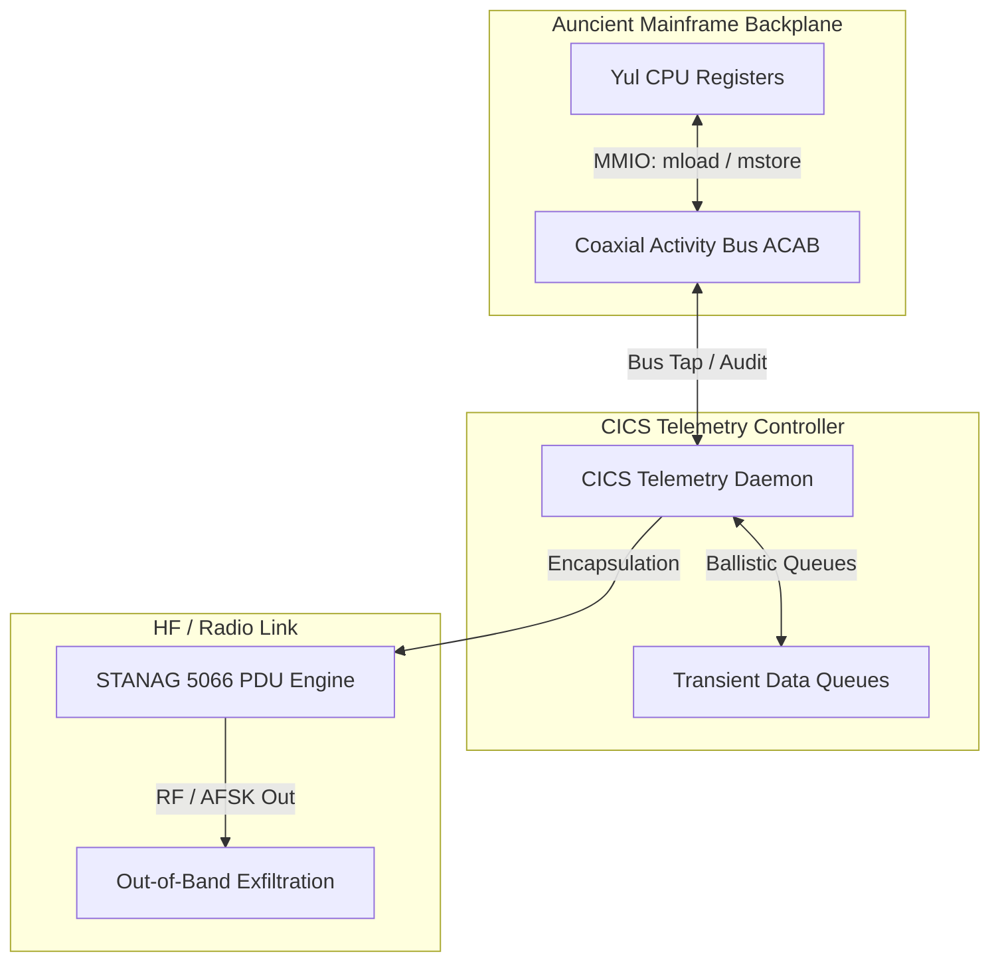

# WAGONBED Capability Emulation: CICS, ACAB, and STANAG Integration

This document details the architectural mapping and operation of the NSA Playset **WAGONBED** hardware implant capabilities using the native **Auncient** Coaxial Activity Bus (ACAB), CICS Web Services, and NATO STANAG 5066 protocol engines.



---

## 1. Architectural Alignment

WAGONBED is a hardware implant designed to tap a server’s internal I2C bus and exfiltrate data out-of-band via GSM. On our mainframe platforms, these hardware capabilities are replicated using software-defined interop interfaces:

| Physical Implant Feature | Mainframe Emulation Counterpart | Function |
| :--- | :--- | :--- |
| **Physical I2C Tap** | **Auncient Coaxial Activity Bus (ACAB)** | Sniffs and injects raw register states (`Base`, `Pole`, `Dynamo`, `Chin`). |
| **Onboard Microcontroller** | **CICS Transaction Controller** | Oversees background task auditing, commands, and ballistic memory queues. |
| **GSM Transceiver** | **STANAG 5066 Protocol Engine** | Formats and transmits telemetry packets over out-of-band HF radio channels. |

---

## 2. Bus Tap Mechanics (ACAB)

The hardware tap is emulated through direct memory-mapped access to the **Auncient** Coaxial Activity Bus (ACAB):

*   **Virtual Tap Point:** The Yul virtual machine exposes state machine registers directly to the shared memory segment of the ACAB.
*   **Registers Monitored:**
    *   `Base`: Tracking root orientation twists ($\phi_w$).
    *   `Signal`: Tracking camera orbital velocities.
    *   `Chin`: Tracking boundary asymmetry bounds.
    *   `Dynamo`: Tracking tone-wheel frequencies.
*   **State Sniffing (`mload`):** The CICS monitoring transaction acts as a bus sniffer, reading the coordinates whenever a state change is committed.
*   **State Injection (`mstore`):** The CICS controller can write overrides (e.g. executing a `Fuse` transaction) to manipulate guest VM hardware registers dynamically.

---

## 3. CICS Transaction Controller

The telemetry daemon runs as a CICS transaction managing queues, state overrides, and task security:

*   **Transient Data Queues (TDQ):** Telemetry payload segments are stored in CICS transient storage queues (`tsfi_cw_unt_cics_queue`).
*   **Ballistic Inputs:** Incoming commands from the out-of-band channel bypass normal guest TCP/IP stacks and are injected directly into the mainframe as ballistic inputs.
*   **Security Auditing (`tsfi_cw_rmu_audit_cics_security`):**
    To prevent arbitrary state overrides (such as spoofed `Fuse` operations seeking to compromise Yul register alignments), the system invokes [tsfi_cw_rmu_audit_cics_security](file:///home/mariarahel/src/tsfi2/atropa_pulsechain/tsfi2-deepseek/src/tsfi_mainframe_computerworld.c#L1357). 
    This security gateway verifies that incoming administrative payloads carry a validated credentials token (starting with `"SEC_"` or matching `"ADMIN"`). Transactions failing this security audit are either discarded or assigned a critical penalty penalty score in security evaluation wrappers, ensuring that hostile bus command injections are locked out at the CICS gateway boundary.

---

## 4. Out-of-Band STANAG Exfiltration

Instead of cellular networks, out-of-band transmission uses NATO STANAG 5066 HF radio frames:

*   **Encapsulation:** Relational tables and ACAB activity records are divided into segments and packed into STANAG 5066 Client Protocol Data Units (C_PDUs).
*   **Frame Verification:** The mainframe verifies frame consistency using [tsfi_mf_nato_verify_stanag5066_header](file:///home/mariarahel/src/tsfi2/atropa_pulsechain/tsfi2-deepseek/inc/tsfi_cade_imf.h#L150).
*   **Transmission:** Data is output via the audio channel as AFSK modulated signals, completely decoupled from standard IP-based networking.

---

## 5. Unified Coaxial Audio Metaphor

From the **Auncient** coaxial perspective, every activity, event, and state transition in the system modulates onto a unified bus as frequency-encoded signals, rendering all system operations structurally compatible with the speech synthesizer:

*   **Unified Bus Modulation (ACAB & ALSA Pipe):** Memory transactions, database records, and event sequences are represented as multi-channel coordinate events mapped onto the **Auncient** Coaxial Activity Bus (ACAB). Instead of raw data structures, every transaction (such as a database edit, key classification, or contract transition) registers as a specific frequency value (e.g., `440.0Hz` representing a `COAXIAL_MODULATION` event).
*   **Formant and Tone-Wheel Synthesis Compatibility:** Because all events resolve to frequency and amplitude coordinate offsets on the coaxial pipe, they feed directly into our speech synthesizer's active tone-wheels. For example, database key upgrades modulate base frequencies via $F_1/F_2$ formant transitions.
*   **Vulkan UI Events as Modulators:** Vulkan mouse movements, keyboard presses, and rendering frames are piped directly onto the coaxial bus as real-time audio parameters. These modulate the synthesizer's active pitch envelopes, jitter/shimmer coefficients, or vocal fry transitions.
*   **STANAG Framing:** The resulting acoustic signals are packetized into STANAG 5066 frames, letting the system serialize and transmit any computing task over audio-frequency AFSK/radio carrier channels.

---

## 6. Relationship to Burroughs VM and DEFCON States

The operating capabilities of the WAGONBED emulation interact directly with the platform's core security systems and threat mitigation pathways:

*   **Burroughs Memory Protections:**
    Because WAGONBED performs low-level sniffing and injection, its activities bypass standard OS layers. To intercept this, the system uses Burroughs B5000-style virtual machine descriptors and segment-limit memory protections. This hardware-level containment detects illegal stack allocations and out-of-bounds pointer changes, blocking unauthorized register injections from rewriting key parameters.
*   **DEFCON Escalation Triggering:**
    When the CICS controller logs a critical security violation (via a failed security audit or invalid bus write), it interfaces directly with the mainframe's national alert systems:
    *   **NORAD Alert Encoding:** The system calls [tsfi_mf_norad_encode_defcon](file:///home/mariarahel/src/tsfi2/atropa_pulsechain/tsfi2-deepseek/src/tsfi_cade_imf_nato.c#L1395) to adjust the active threat levels dynamically based on detected anomalies.
    *   **NAAP Broadcasts:** The CICS daemon broadcasts emergency alerts using [tsfi_mf_cics_generate_naap_broadcast](file:///home/mariarahel/src/tsfi2/atropa_pulsechain/tsfi2-deepseek/src/tsfi_cade_imf_nato.c#L1476), notifying linked stations of an ongoing system intrusion.
    *   **IBM 3270 Alert Formatting:** The terminal updates dynamically using [tsfi_mf_cics_format_3270_map](file:///home/mariarahel/src/tsfi2/atropa_pulsechain/tsfi2-deepseek/src/tsfi_cade_imf_nato.c#L1534), printing warning banner overlays across active user console screens.

---

## 7. Playing Oregon Trail over WAGONBED

The platform supports playing the simulated **Oregon Trail** application over WAGONBED's bus-writing pathways:

```
  [ User Keystroke ] 
          │
          ▼
  [ CICS Input Receiver ] ──► (Ballistic Event Queue)
          │
          ▼ (WAGONBED Intercept)
  [ ACAB Bus Address 0x0200 ] ◄── (mstore poke operation)
          │
          ▼ (cpu6502 Poll)
  [ MOS 6502 core (folklore.yul) ]
          │
          ▼
  [ Oregon Trail Token / HUD Update ]
```

*   **Keystroke Redirection:** Keystone inputs are captured by CICS as ballistic queue data. 
*   **WAGONBED Memory Injection:** The WAGONBED controller intercepts the keystroke codes and executes a `poke` (`mstore`) directly to RAM address `0x0200` on the **Auncient** Coaxial Activity Bus (ACAB).
*   **c6502 Game Engine Loop:** The simulated `c6502` virtual machine (running `folklore.yul` assembly) fetches inputs by executing a `peek` (`mload`) on register `0x0200`. The 6502 execution thread processes the command (updating game state criteria like distance traveled, food consumption, or hunting results) and writes the updated telemetry data to the on-chain `oregonTrailToken` structure to synchronize HUD metrics.

---

## 8. Summary Operational Note

The integration of the **Auncient** Coaxial Activity Bus (ACAB) with CICS transient storage queues and the `c6502` core represents a complete, self-contained implementation of the WAGONBED hardware implant concept. By utilizing memory-mapped register tapping and out-of-band radio transmissions, the system replicates hardware-level sniffing and injection while maintaining strict transaction security auditing through native security gateways.


