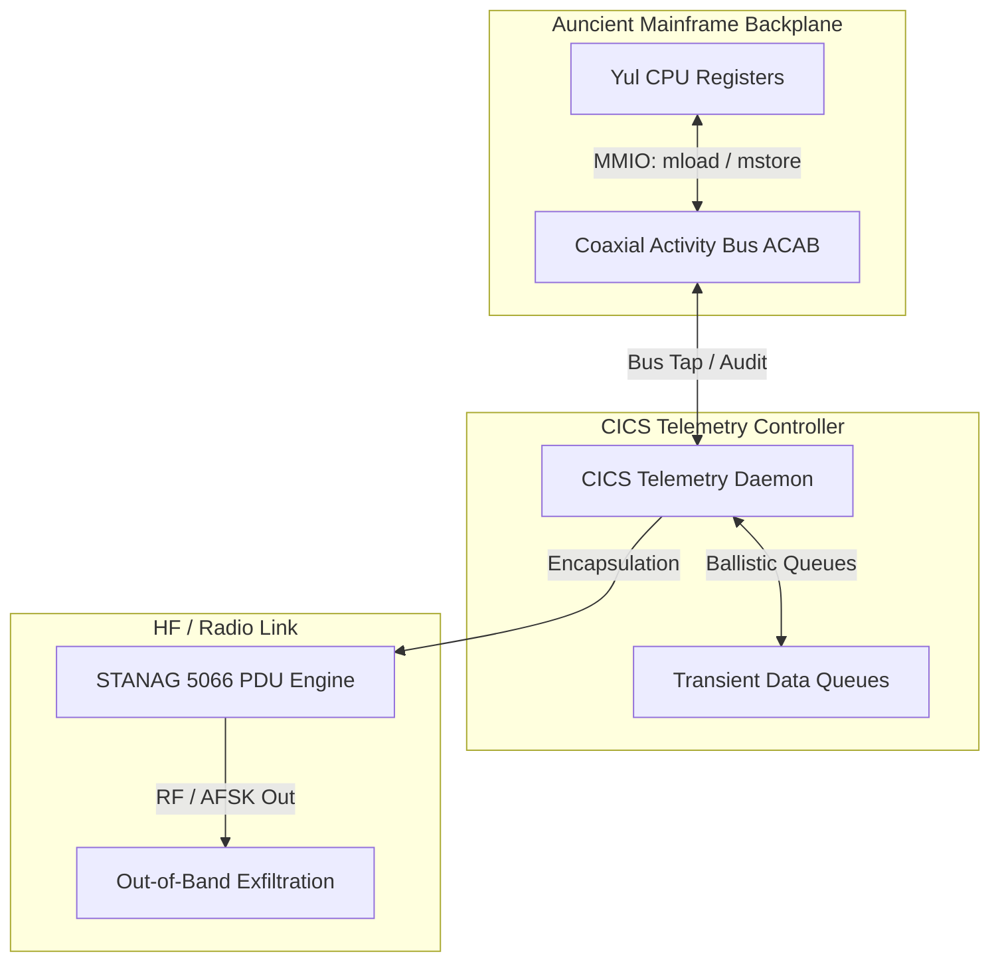

# WAGONBED Capability Emulation: CICS, ACAB, and STANAG Integration

This document details the architectural mapping and operation of the NSA Playset **WAGONBED** hardware implant capabilities using the native **Auncient** Coaxial Activity Bus (ACAB), CICS Web Services, and NATO STANAG 5066 protocol engines.

---

## 1. Architectural Alignment

WAGONBED is a hardware implant designed to tap a server’s internal I2C bus and exfiltrate data out-of-band via GSM. On our mainframe platforms, these hardware capabilities are replicated using software-defined interop interfaces:

| Physical Implant Feature | Mainframe Emulation Counterpart | Function |
| :--- | :--- | :--- |
| **Physical I2C Tap** | **Auncient Coaxial Activity Bus (ACAB)** | Sniffs and injects raw register states (`Base`, `Pole`, `Dynamo`, `Chin`). |
| **Onboard Microcontroller** | **CICS Transaction Controller** | Oversees background task auditing, commands, and ballistic memory queues. |
| **GSM Transceiver** | **STANAG 5066 Protocol Engine** | Formats and transmits telemetry packets over out-of-band HF radio channels. |

---

## 2. Bus Tap Mechanics (ACAB)

The hardware tap is emulated through direct memory-mapped access to the **Auncient** Coaxial Activity Bus (ACAB):

*   **Virtual Tap Point:** The Yul virtual machine exposes state machine registers directly to the shared memory segment of the ACAB.
*   **Registers Monitored:**
    *   `Base`: Tracking root orientation twists ($\phi_w$).
    *   `Signal`: Tracking camera orbital velocities.
    *   `Chin`: Tracking boundary asymmetry bounds.
    *   `Dynamo`: Tracking tone-wheel frequencies.
*   **State Sniffing (`mload`):** The CICS monitoring transaction acts as a bus sniffer, reading the coordinates whenever a state change is committed.
*   **State Injection (`mstore`):** The CICS controller can write overrides (e.g. executing a `Fuse` transaction) to manipulate guest VM hardware registers dynamically.

---

## 3. CICS Transaction Controller

The telemetry daemon runs as a CICS transaction managing queues and task verification:

*   **Transient Data Queues (TDQ):** Telemetry payload segments are stored in CICS transient storage queues (`tsfi_cw_unt_cics_queue`).
*   **Ballistic Inputs:** Incoming commands from the out-of-band channel bypass normal guest TCP/IP stacks and are injected directly into the mainframe as ballistic inputs.
*   **Security Auditing:** CICS transactions (e.g. `tsfi_cw_rmu_audit_cics_security`) monitor the activity bus, preventing unauthorized memory modifications while logging standard audits.

---

## 4. Out-of-Band STANAG Exfiltration

Instead of cellular networks, out-of-band transmission uses NATO STANAG 5066 HF radio frames:

*   **Encapsulation:** Relational tables and ACAB activity records are divided into segments and packed into STANAG 5066 Client Protocol Data Units (C_PDUs).
*   **Frame Verification:** The mainframe verifies frame consistency using [tsfi_mf_nato_verify_stanag5066_header](file:///home/mariarahel/src/tsfi2/atropa_pulsechain/tsfi2-deepseek/inc/tsfi_cade_imf.h#L150).
*   **Transmission:** Data is output via the audio channel as AFSK modulated signals, completely decoupled from standard IP-based networking.
