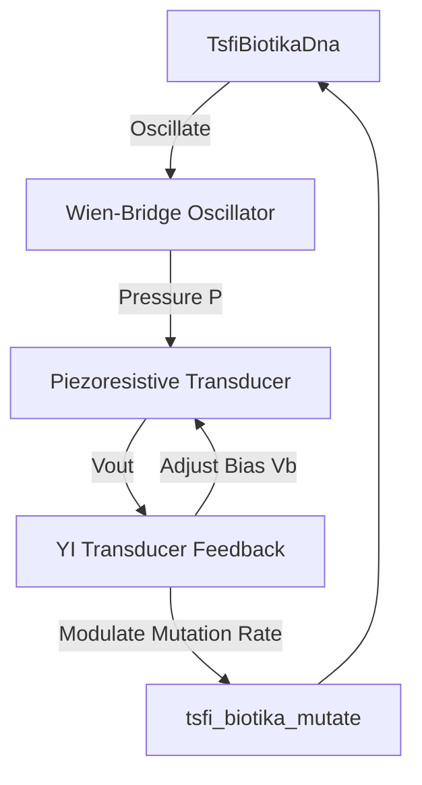

# 🔮 The YI Mechanical Transducer Design Paradigm

This document outlines the conceptual and mathematical alignment between the **Dysnomia YI Reaction Engine** and the **Physical Transducer Stage**. By treating the reactive `YI` node as a mechanical transducer, we close the feedback loop between genetic DNA synthesis and neural processing.

---

## 1. Structural Equivalence

The physical piezoresistive microphone transducer maps acoustic pressure to collector voltage. In parallel, the `YI` node maps modular input signals to reciprocal output keys:

| Parameter | Physical Transducer ([tsfi_prophecy.c](file:///home/mariarahel/src/tsfi2/atropa_pulsechain/tsfi2-deepseek/src/tsfi_prophecy.c)) | Mathematical Transducer (`YI` / `SHA` in [tsfi_reaction.c](file:///home/mariarahel/src/tsfi2/atropa_pulsechain/tsfi2-deepseek/src/tsfi_reaction.c)) |
|---|---|---|
| **Input A** | Sound Pressure Wave ($P$) | Input Signal BigInt ($P_i$) |
| **Input B** | Electrical Bias ($V_b$) | Channel Coupling ($\Theta$) |
| **Constraints** | $V_{be}$ Barrier Offset ($0.1\text{V} - 1.0\text{V}$) | Prime Modulus ($P_{bn}$) |
| **Transfer Function** | Gain ($\beta = 150$), Load Resistor ($R_c = 2200$) | Modular Exponentiation (`modExp64`) |
| **Output** | Collector Voltage ($V_{out} \in [0.0, 9.0]\text{V}$) | Reaction Products (`Ichidai`/`Daiichi` in `struct Dai`) |

---

## 2. Closed-Loop Synthesis Integration

Within the DNA auto-breeding pipeline, the `YI` transducer is integrated into three feedback structures:

### A. Dynamic Bias Regulation
The output of the physical transducer modulates the modular input $P_i$ to the `YI` reaction. The resulting `Ichidai` output is scaled back to a voltage range $[0.0, 1.0]$ and injected as the `electrical_bias` ($V_b$) for the next audio frame.

### B. Adaptive Genetic Mutation
The verification status of the `YI` reaction determines the mutation rate applied in [tsfi_elektuur_issue25.c](file:///home/mariarahel/src/tsfi2/atropa_pulsechain/tsfi2-deepseek/src/tsfi_elektuur_issue25.c):
* **Balanced Reaction** (Reciprocity succeeds): The system is stable; genetic mutation rate is minimized ($0.01$).
* **Unbalanced Reaction** (Reciprocity panics/fails): The system is in a high-entropy state; the genetic mutation rate increases ($0.25$) to steer the DNA away from unstable physical regions.
