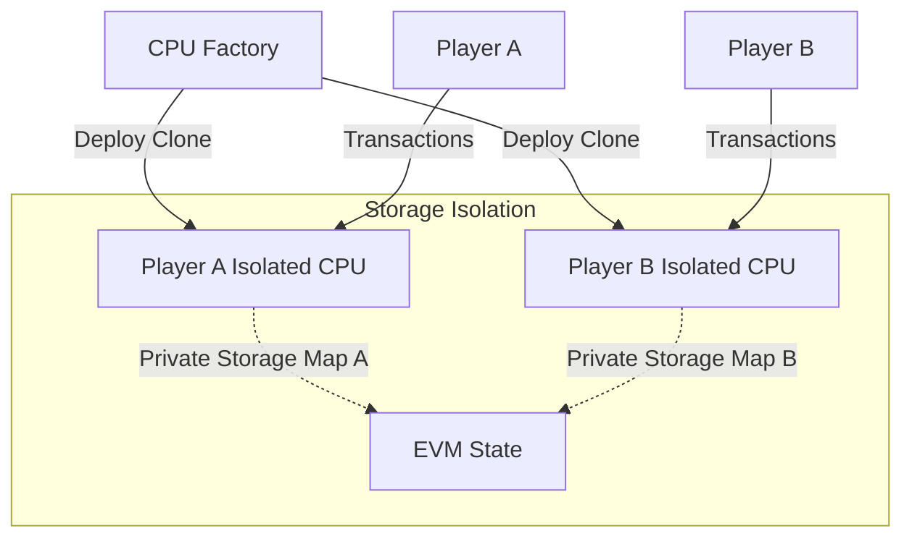

# Security Audit: Yul VM Hardware Isolation Model

This document addresses concerns regarding unauthorized state manipulation across different players sharing the same on-chain virtual machine contracts (like the Folklore CPU and 6502 Emulator). It audits the singleton storage pattern and provides recommendations for enforcing absolute VM isolation.

---

## 1. The Singleton Storage Vulnerability

In the current setup, all players interact with a single deployed instance of the Folklore CPU (`folkloreAddress`) and the Z-Machine (`zmachineAddress`). 

### The Risk of `pokeUser`
In Yul contracts that support `pokeUser(address user, uint256 addr, uint256 val)` (such as the 6502 CPU):
* If the function is public and does not validate the relationship between `msg.sender` and the target `user` address, **any external caller** can invoke:
  `pokeUser(victimAddress, 55050, 1)`
* This allows an attacker to directly mutate the virtual registers of any other player, bypass quest requirements, or steal CABS escrow payouts.

### The Risk of Shared Memory Corruption
Even if write functions are namespaced using `caller()`:
* If a contract calls the CPU on behalf of a user, the `caller()` inside the CPU is the contract's address, not the user's.
* If multiple users interact with the CPU through the same helper contract, they share the contract's storage namespace in the CPU, leading to state collisions and race conditions.

---

## 2. Recommendation A: VM Factory Pattern (Absolute Physical Isolation)

The most secure design for on-chain virtual machine hardware is to deploy a **separate contract instance for each player**. 

Instead of a single shared contract, a `CPUFactory` contract deploys a lightweight clone of the CPU bytecode for every player:



### Advantages:
1. **OS-Level Sandbox**: Each player has their own contract address. It is physically impossible for Player A to write to Player B’s contract storage because they are separate accounts on the blockchain.
2. **Simplified Code**: We can completely remove complex namespacing functions (`getUserSlot` / `getContextUser`) from the Yul bytecode. The CPU can write directly to flat storage slots (e.g., `sstore(addr, val)`), which dramatically reduces gas consumption.
3. **Owner Validation**: The isolated CPU contract constructor can set the player as the immutable `Owner`, reverting any `poke` calls if `msg.sender != Owner`.

---

## 3. Recommendation B: Cryptographic Access Control Lists (ACL)

If a singleton CPU contract must be used (e.g., to preserve factory-allocated addresses), strict **Access Control Lists** must be enforced in the Yul dispatch tables.

### Implementing Caller Checks in Yul:
For any function that modifies another user's state (like `pokeUser` or `poke`), the Yul code must verify that the caller is either the user themselves or an authorized system contract:

```solidity
// Pseudocode for Yul runtime authorization check
let callerAddress := caller()
let targetUser := calldataload(4) // The user parameter

// 1. Allow the user to modify their own state
let isAuthorized := eq(callerAddress, targetUser)

// 2. Allow bound CABS system contracts to modify state
let authorizedMarketMachine := sload(0x999) // Store CABS contract address in slot 0x999
if eq(callerAddress, authorizedMarketMachine) {
    isAuthorized := 1
}

// 3. Revert if unauthorized
if iszero(isAuthorized) {
    revert(0, 0)
}
```

By adding this authorization check, malicious third parties are blocked from manipulating the registers of other players' virtual hardware.
