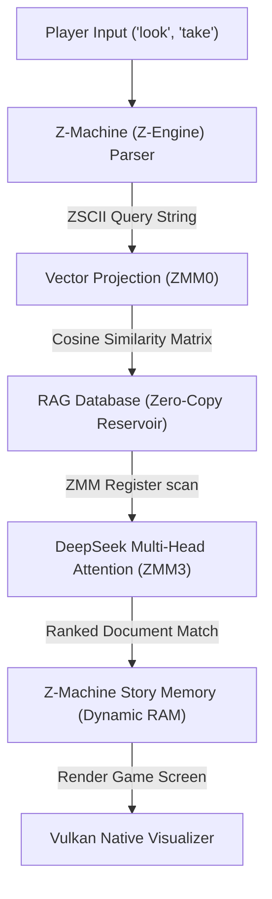

# Unified ZMM Z-Engine & RAG (Retrieval-Augmented Generation) Architecture

This document outlines the system architecture to unite **AVX-512 ZMM Vector Registers**, the **Z-Machine (Z-Engine)** story interpreter, and **RAG (Retrieval-Augmented Generation)** database scans on the TSFi2 platform.

---

## 1. Unified Architecture Overview

The system bridges the text parser of the 8-bit Z-Machine with high-dimensional AI vector space calculations executed on 512-bit ZMM hardware registers:



---

## 2. ZMM-Accelerated RAG Retrieval (C / AVX-512)

The RAG search queries the database of text blocks using parallel 512-bit registers via `tsfi_registry_scan_zmm`:

```c
#include "tsfi_opt_zmm.h"

// Scans database blocks (512-bit wide chunks) for query cosine similarity matches
LauMetadata* tsfi_registry_scan_zmm(LauRegistryManifold *m, void *query_vector) {
    __m512 q = _mm512_loadu_ps((float*)query_vector);
    LauMetadata *best_match = NULL;
    float best_score = -1.0f;

    LauMetadata *current = m->head;
    while (current) {
        float *db_vector = (float*)current->payload_start;
        __m512 d = _mm512_loadu_ps(db_vector);
        
        // Dot Product similarity using AVX-512
        __m512 dot = _mm512_mul_ps(q, d);
        float sum = _mm512_reduce_add_ps(dot);
        
        if (sum > best_score) {
            best_score = sum;
            best_match = current;
        }
        current = current->next;
    }
    return best_match;
}
```

---

## 3. Z-Machine Integration (Yul)

The Z-Machine contract queries the ZMM-RAG backend when a player executes parser inputs. The matching ranked responses are loaded dynamically into Z-Machine object property slots:

```yul
case 0xf1ba03f9 { // parseCommand(address player, bytes cmd)
    let queryHash := keccak256(add(cmd, 32), mload(cmd))
    
    // Call RAG lookup registry contract (returns best-matching text object ID)
    mstore(0x300, shl(224, 0x5d5517bf)) // getVectorScene / RAG query selector
    mstore(0x304, queryHash)
    let success := staticcall(gas(), 0x4B4519ab516f2d209b3EFC25d7Eb5839615e49C4, 0x300, 36, 0x344, 32)
    let matchedObjectId := mload(0x344)
    
    // Update Z-Machine Dynamic Memory Object Table directly
    writeObjectProperty(matchedObjectId, 5, 1) // Set property 5 (Active Room) to 1
}
```

---

## 4. Vulkan Display & DeepSeek Consensus
* **Vulkan Render**: The Z-Machine's active room index triggers corresponding vector-graphic outline queries via `getVectorScene(roomIndex)`. These lines are drawn immediately to the Doodle Graphics buffer, rendering rooms dynamically inside the Vulkan visualizar window.
* **DeepSeek Consensus**: Vector allocations and similarity metrics are compared against the active `acousticOracle` block validation registry to verify execution authenticity.
